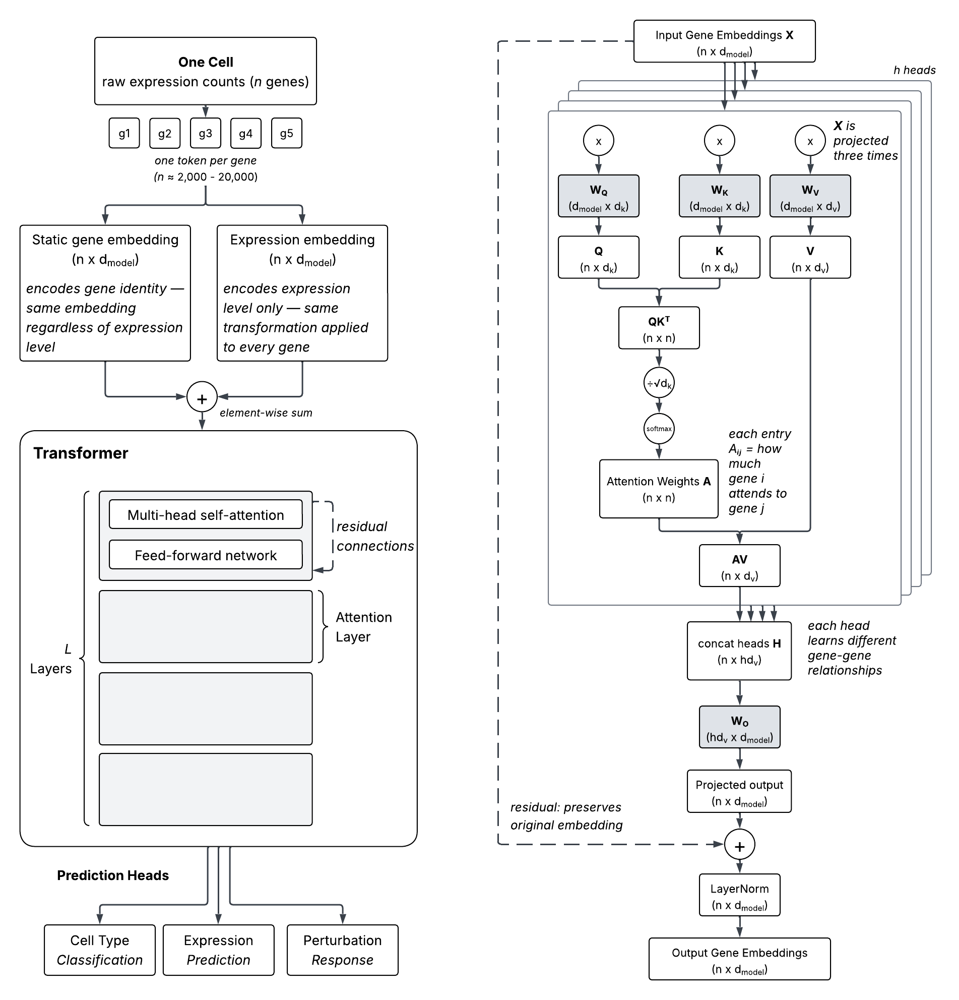

Foundation models trained on large corpuses of single-cell RNA-seq data have emerged as one of the most promising frontier technologies in biotech. These models embed cells' expression in a latent space, and then use a transformer architecture to attend to expression embeddings, learning functional coexpression patterns, which can be used to predict diverse properities such as cell type or denoised expression.

These models are build on massive datasets provided by Chan-Zuckerberg Initiative (CZI), Arc Institute, Tahoe Therapeutics and others ([CellxGene](https://cellxgene.cziscience.com/datasets), [Tahoe 100M](https://www.biorxiv.org/content/10.1101/2025.02.20.639398v1), [upcoming dataset](https://biohub.org/news/arc-tahoe-perturbation-dataset/)). Emerging datasets bring additional cellular contexts, making more predictions in-distribution rather than out-of-distribution, and causal grounding with genetic perturbations provides the potential to move beyond coexpression. This causal signal is now being fruitfully mined with impressive results by Altos lab's Cleopatra model in the Arc Insitutes 2025 [Virtual Cell Challenge](https://virtualcellchallenge.org/leaderboard). 

Foundation models themselves are continually evolving as academic and instrustry groups experiment with model architectures, inductive biases, new tasks, etc. Now, there is a diverse array of models available through platforms like [CZI models](https://cellxgene.cziscience.com/census-models) and [NVIDEA BioNeMo](https://www.nvidia.com/en-us/industries/healthcare-life-sciences/biopharma/) which can be applied to single-cell RNAseq, sequences, analysis and structural prediction.

The excitement for foundation models and their evolution into multi-scale multi-modal Virtual Cell model is palpable - they form a cornerstone in the CZI's aspirational goal to "cure, prevent, or manage all diseases by the end of this century". (Incidentally, this would require [stopping biological aging](https://www.shackett.org/gompertz/)!)

A clear architecture for this ambition is nicely stated in [How to build the virtual cell with artificial intelligence: Priorities and opportunities](https://pubmed.ncbi.nlm.nih.gov/39672099/). In this paper the authors highlight how **universal representations** of biology could be created at the level of molecules, cells, and multicellular interactions, and different data streams could feed into virtual cell models at an appropriate level. This provides the potential for both forward and reverse engineering biology - predicting how a DNA variant impacts tissue physiology, while also enabling us to backtrack from tissue pathophysiology to distributed molecular circuits (and drug targets!).

These universal representations can be supported with **synthetic instruments** to make diverse predictions, but also with decoders to map a virtual cell's state back to human-interpretable, semantically-meaningful biology. 

Here, I will explore what a synthetic instrument might look like for decoding the attention mechanisms of four scRNAseq-based foundation models using established molecular interactions. Specifically, I will:

1. Provide an overview of single-cell foundation Models, introducing abstractions which will help both clarify concepts and enable generalization.
2. Extract expression-contextualized gene embeddings and weights from scGPT, scFounation, scPRINT, and AIDO.Cell using model-agnostic data structures.
3. Compare attention patterns across layers and across models to identify when models are learning common genic signatures.
4. Compare topK attention pairs from each model/layer to the 50K vertex, 8M edges Napistu Octopus network to identify enrichment of reported interactions.
5. Compare topK attention pairs to a GNN trained using self-supervised edge prediction on this graph to assess whether attention pairs appear similarly to molecular interactions.

## What is a single-cell RNAseq foundation model?

A gene expression foundation model takes a single cell as input and learns to represent it by processing the expression levels of thousands of genes simultaneously. To do this, each expressed gene is treated as a token — the basic unit of input, analogous to a word in a language model — and the model learns a rich representation of the cell by modeling how genes relate to one another.

Each gene token is built from two separate components. The first is a **static gene embedding**: a learned vector that encodes the identity of the gene itself, independent of how highly it's expressed in any particular cell. This is analogous to a word embedding in NLP — it captures what a gene is, not what it's doing in this cell. The second is an **expression embedding**: a transformation of the raw count that encodes how active the gene is in this specific cell. These two streams are combined — typically by element-wise addition — to produce a token that carries both "which gene" and "how expressed" information before being passed into the transformer.

The transformer then processes this sequence of gene tokens through multiple layers of multi-head self-attention. Each attention layer computes, for every gene, a weighted combination of all other genes' representations, where the weights reflect how relevant each gene is to understanding the current one. The result is a set of contextualized gene embeddings — representations that encode not just a gene's own identity and expression, but its relationship to the broader transcriptional state of the cell.

The figure below shows the full architecture alongside a detailed view of how a single attention layer operates — from the query, key, and value projections through to the gene-gene attention weights that make these models interpretable.



**You compare your query against every key to decide how much attention to give each source, then you pull a weighted mixture of their values.**

With this architecture in place, the key question is what the model is trained to do. The most common pretraining objective for bag-of-genes models is masked expression reconstruction: a random subset of gene expression values are zeroed out, and the model must predict the original values using only the remaining genes as context. This forces the model to learn co-expression relationships — to recover a masked gene's expression, it must attend to the genes that are co-regulated with it. The attention weights that emerge from this process directly reflect gene-gene relationships, since a gene's representation is literally built from weighted combinations of its neighbors in expression space.

Not all foundation models fit neatly into this framework. Some, like Geneformer, use a ranked gene sequence rather than a bag of genes, ordering tokens by expression level rather than presenting them all simultaneously. Others, like UCE, sample gene tokens proportional to expression count, allowing the same gene to appear multiple times. These architectural choices affect what the model learns and how its representations can be interpreted. Importantly, for the bag-of-genes models, the n × n attention weight matrix has a direct biological interpretation: entry $A_{ij}$ captures how much gene i attends to gene j when building its contextual representation.

The table below summarizes how eight prominent foundation models instantiate this general framework, highlighting the key architectural choices that determine what each model attends to and what it learns.

```{python}
#| label: summarize_scfms
#| echo: false

import pandas as pd

FM_SUMMARY = "1WwA0IPrz-w12ubT5Atz1BmP6AK8nseZzDvqhxiJo3I8"
url = f"https://docs.google.com/spreadsheets/d/{FM_SUMMARY}/export?format=csv"

df = pd.read_csv(url)
df
```

## Processing foundation models

Each foundation model arrives with its own ecosystem: private Python dependencies, bespoke preprocessing pipelines, and idiosyncratic gene vocabularies. Running multiple models in a single environment is often impractical, so I adopted a two-environment pattern. Each model is processed in its own isolated environment by a dedicated process_x() function that handles model loading, dataset preprocessing, and the forward pass. The results are serialized to a pair of files — {prefix}_weights.npz and {prefix}_metadata.json — that capture everything needed for downstream analysis. A separate analysis environment then reconstructs the full object via `FoundationModel.load()`, with no knowledge of or dependency on the original model library.

```{text}
FoundationModels
    FoundationModel
        FoundationModelWeights
            GeneEmbeddings (static)
                GeneAnnotations
            List[AttentionLayer]
        DatasetGeneEmbeddings
            GeneEmbeddingsSet (all embeddings for a given dataset)
                GeneEmbeddings (a single 2D embedding matrix, e.g., of a cell type or cluster)
                    GeneAnnotations
        ModelMetadata
```

The object-oriented design pays off immediately in two ways. First, Pydantic validation enforces that each model's data is formatted consistently — gene annotations must contain the required identifier columns, embedding dimensions must be internally consistent, and vocabulary sizes must match. Second, the save/load round-trip is clean and lossless, which is what makes the two-environment pattern work in practice. Each GeneEmbeddings instance stores both the native vocabulary used by the source model and systematic Ensembl gene IDs, so genes can be matched across models without discarding the original identifiers. Later, we will see how `AttentionPatternsInputs` builds on this structure to pair embeddings with attention weights for interpretation.

<<bio-aside>>
When a cell's expression profile is passed through the model, each gene receives a combined input — its static identity embedding summed with an expression embedding encoding its count in that cell. The transformer then contextualizes these joint representations by attending across all genes simultaneously, so each gene's final output reflects not just its identity and expression level but the full transcriptional context of that cell. I aggregate these contextualized representations at the cell type level — grouping cells into leiden clusters and averaging — for two reasons. First, a cluster's average embedding remains close to its individual members in latent space, so the aggregation is faithful. Second, cell-type resolution is the natural unit for mechanistic interpretation: what we want to understand is which regulatory circuits are active in a given cell type, and a cell-type-level expression embedding provides exactly that perspective.
<</bio-aside>>

## Loading foundation models

### Environment setup

Most of my posts build off of artifacts hosted on GCS or GitHub but to reproduce this one you will need to first process models from scratch (the weights are ~5 GB and I'm not keen to serving these from my personal GCS indefinitely).

1. For model-specific processing refer to [foundation model ETL](https://github.com/napistu/napistu-scrapyard/tree/main/applications/foundation_models).

2. Install [uv](https://docs.astral.sh/uv/#highlights) (or use `pip` if preferred).

3. Set up a Python environment:

```bash
uv venv --python 3.11
source .venv/bin/activate
# Core dependencies
uv pip install torch==2.8.0
uv pip install torch-scatter torch-sparse -f https://data.pyg.org/whl/torch-2.8.0+cpu.html
uv pip install "napistu-torch[pyg]==0.3.12"
# if you'd like to render the notebook, you'll need to install these additional dependencies
uv pip install seaborn ipykernel nbformat nbclient umap-learn
python -m ipykernel install --user --name=blog-staging
```

4. Download the [`interpreting_sc_foundation_models.qmd`](https://github.com/shackett/shackett/blob/master/posts/posted/interpreting_sc_foundation_models.qmd) notebook (or copy and paste the relevant code blocks).

5. Configure `EXPERIMENTS_DIR` and other paths in the `env_setup` code block to point to your local directories.

### Configuration and imports

```{python}
#| label: env_setup
#| output: false

# standard library
import logging
import os
import re
from pathlib import Path
from typing import List, Optional, Tuple

# 3rd party
import pandas as pd
import numpy as np
import matplotlib.cm as cm
import matplotlib.pyplot as plt
from matplotlib.colors import LinearSegmentedColormap
import seaborn as sns
import torch

# Napistu
from napistu.utils import load_pickle, save_pickle
from napistu.constants import BQB_DEFINING_ATTRS_LOOSE, SBML_DFS
from napistu.ontologies.constants import ONTOLOGIES
from napistu.network.constants import NAPISTU_GRAPH_VERTICES, NAPISTU_GRAPH_EDGES

# Napistu-Torch
from napistu_torch.load.constants import DEFAULT_ARTIFACTS_NAMES
from napistu_torch.evaluation.manager import RemoteEvaluationManager
from napistu_torch.foundation_models.attention_patterns import (
    AttentionPatternsInputs,
    aggregate_embedding_comparisons_over_categories,
    validate_embedding_comparisons_settings,
)
from napistu_torch.foundation_models.foundation_models import (
    FoundationModelStore,
    FoundationModels,
    _get_disk_name,
)
from napistu_torch.foundation_models.constants import COMPARE_EMBEDDINGS_COMPARISONS, FM_EDGELIST, MODEL_NICE_NAMES
from napistu_torch.napistu_data_store import NapistuDataStore
from napistu_torch.utils.napistu_utils import map_identifiers_to_vertex_names
from napistu_torch.utils.pd_utils import reorder_multindex_by_categorical_and_numeric
from napistu_torch.utils.tensor_utils import compute_correlation_matrix, compute_cosine_distances_torch
from napistu_torch.visualization.heatmaps import plot_heatmap

logging.basicConfig(level=logging.INFO, format='%(levelname)s:%(name)s:%(message)s')
logger = logging.getLogger(__name__)

# paths
PROJECT_DIR = Path("~/Desktop/DATA/sc_foundation_models").expanduser()
CACHE_DIR = PROJECT_DIR / "cache"
MODEL_OUTPUTS_DIR = PROJECT_DIR / "model_outputs" # where extracted foundation model weights 
STORE_DIR = Path("~/Desktop/EXPERIMENTS/.store").expanduser() # where Napistu data and models are stored (pulled from Hugging Face)

# settings affecting the structure of the analysis
INCLUDE_SCGPT = True
SCGPT_MODEL_NAME = "scGPT"  # process with and without scGPT since scGPT only uses the top 1200 highly variable genes
INCLUDE_SCFOUNDATION = False  # pairwise comparisons/visualizations omit scFoundation unless True and MODEL_OUTPUTS_DIR has weights
SCFOUNDATION_MODEL_NAME = "scFoundation"
IGNORE_CATEGORIES_WITH = ["unknown"]
IGNORED_MODELS = ["AIDOCell_aido_cell_100m"]
HF_GNN_REPOSITORY = "seanhacks/edge_prediction_mlp_256e" 
EMBEDDING_DATASET = "efthymiou2025" # An adipose tissue dataset from Eftimiou et al. 2025

# settings affecting specific functions and behavior
CONSENSUS_METHOD = "sum" # how to rollup layers (for this notebook this only affects some summaries which are created but not used.)
BY_ABSOLUTE_VALUE = False # select top attention pairs by absolute value or just the most positive
TOP_K = 10000 # how many top attention pairs to consider
IGNORE_SELF_ATTENTION = True # ignore self-attention (i.e., the attention of a gene to itself)
OVERWRITE = False
VERBOSE = False
COMPARISON_TYPES = [
    COMPARE_EMBEDDINGS_COMPARISONS.MODEL_LAYER_CORRELATIONS,
    COMPARE_EMBEDDINGS_COMPARISONS.CROSS_MODEL_X_LAYER_TOP_ATTENTIONS,
    COMPARE_EMBEDDINGS_COMPARISONS.CROSS_MODEL_X_LAYER_RANK_AGREEMENT,
    COMPARE_EMBEDDINGS_COMPARISONS.CROSS_MODEL_CONSENSUS_TOP_ATTENTIONS,
    COMPARE_EMBEDDINGS_COMPARISONS.CROSS_MODEL_CONSENSUS_TOP_ATTENTIONS_RANK_AGREEMENT,
]

# general defs

MODEL_CATEGORIES = pd.DataFrame([
    {"model type": "scGPT", "model_category" : "scGPT"},
    {"model type": "scPRINT", "model_category" : "scPRINT"},
    {"model type": "scFoundation", "model_category" : "GenBioAI"},
    {"model type": "AIDOCell", "model_category" : "GenBioAI"},
])
EXPECTED_NAME_TO_SID_MAP_COLUMNS = {SBML_DFS.S_ID, NAPISTU_GRAPH_VERTICES.NAME}

bwy = LinearSegmentedColormap.from_list(
    "blue_white_yellow",
    ["#2166AC", "#FFFFFF", "#F5C800"]  # strong blue → white → bright yellow
)

# 1-off functions
# data and path management

def to_filename(s: str) -> str:
    s = re.sub(r'[^\w\s-]', '', s)
    s = re.sub(r'\s+', '_', s)
    return s.strip('-_')


def get_cache_path(dataset: str, category: str, include_scgpt: bool) -> Path:
    scgpt_flag = "with_scgpt" if include_scgpt else "without_scgpt"
    return CACHE_DIR / f"comparisons_{dataset}_{to_filename(category)}_{scgpt_flag}.pkl"


def get_all_categories(
    output_dir: str = MODEL_OUTPUTS_DIR,
    embedding_dataset: str = EMBEDDING_DATASET,
    ignore_categories_with: List[str] = IGNORE_CATEGORIES_WITH,
) -> List[str]:
    
    model_names = get_model_names()
    stores = [
        FoundationModelStore(Path(output_dir) / name)
        for name in model_names
    ]

    category_sets = [
        set(store.list_categories(embedding_dataset))
        for store in stores
    ]

    common = category_sets[0].intersection(*category_sets[1:])

    all_categories = sorted([
        cat for cat in common
        if not any(substring in cat for substring in ignore_categories_with)
    ])
    
    # TO DO - tmp while more categories are being processed
    # all_categories = all_categories[0:5]

    return all_categories


def append_scfoundation_metadata_stub(model_metadata_summary: pd.DataFrame) -> pd.DataFrame:
    """If scFoundation weights are absent, preserve a readable row for `show_model_metadata_table`."""
    if "model type" not in model_metadata_summary.columns:
        return model_metadata_summary
    if SCFOUNDATION_MODEL_NAME in model_metadata_summary["model type"].astype(str).values:
        return model_metadata_summary
    label = MODEL_NICE_NAMES.get((SCFOUNDATION_MODEL_NAME, None), SCFOUNDATION_MODEL_NAME)
    row = {c: pd.NA for c in model_metadata_summary.columns}
    row["model"] = label
    row["model type"] = SCFOUNDATION_MODEL_NAME
    return pd.concat([model_metadata_summary, pd.DataFrame([row])], ignore_index=True)


def get_model_comparison_metadata(
    include_scgpt: bool = True,
    include_scfoundation: Optional[bool] = None,
):

    include_sf = INCLUDE_SCFOUNDATION if include_scfoundation is None else include_scfoundation

    model_comparison_metadata = dict()

    models = FoundationModels.load_multiple(
        MODEL_OUTPUTS_DIR,
        get_model_names(include_scgpt, include_scfoundation=include_sf),
        verbose=False,
    )
    model_comparison_metadata["model_order"] = models.model_names

    model_metadata_summary = models.get_summary().rename(
        columns={
            "full_name": "model",
            "model": "model type",
            "variant": "model variant",
            "embed_dim": "# embedding dim",
            "n_layers": "# layers",
            "n_heads": "# heads",
            "parameter_count": "# parameters",
        }
    )

    # Gene count per model — load one category's residuals to get n_genes
    # All categories for a model share the same gene set so any category works
    def _n_genes_for_model(model):
        a_category = model.store.list_categories(EMBEDDING_DATASET)[0]
        layer_embeddings = model.load_category_residuals(EMBEDDING_DATASET, a_category)
        any_ge = next(iter(layer_embeddings.values()))
        return any_ge.n_genes

    model_metadata_summary["# genes in dataset embedding"] = [
        _n_genes_for_model(m) for m in models.models
    ]
    model_comparison_metadata["model_metadata_summary"] = model_metadata_summary

    # Common genes across models — from_expression handles alignment and intersection
    a_category = models.models[0].store.list_categories(EMBEDDING_DATASET)[0]
    attended_embeddings = AttentionPatternsInputs.from_expression(
        models, EMBEDDING_DATASET, a_category, verbose=False
    )
    model_comparison_metadata["gene_ids"] = attended_embeddings.common_gene_ids

    return model_comparison_metadata


def get_model_label_maps(model_metadata_summary):
    model_type_map = model_metadata_summary.set_index('model')['model type'].to_dict()
    model_variant_map = model_metadata_summary.set_index('model')['model variant'].to_dict()
    return model_type_map, model_variant_map


def get_model_names(
    include_scgpt: bool = True,
    include_scfoundation: Optional[bool] = None,
    ignored_models: List[str] = IGNORED_MODELS,
) -> List[str]:
    """Return disk names for all models to include in analysis.

    Parameters
    ----------
    include_scgpt : bool
        Whether to include scGPT (default: True).
    include_scfoundation : Optional[bool]
        Whether to load scFoundation from disk when present. Uses ``INCLUDE_SCFOUNDATION`` when omitted.
    ignored_models : List[str]
        Model disk names to exclude.

    Returns
    -------
    List[str]
        Disk names matching subdirectory names under MODEL_OUTPUTS_DIR.
    """
    inc_sf = INCLUDE_SCFOUNDATION if include_scfoundation is None else include_scfoundation
    full_names = [
        _get_disk_name(model_name, model_variant)
        for model_name, model_variant in MODEL_NICE_NAMES
        if include_scgpt or model_name != SCGPT_MODEL_NAME
        if inc_sf or model_name != SCFOUNDATION_MODEL_NAME
    ]

    if ignored_models:
        invalid = [name for name in ignored_models if name not in full_names]
        if invalid:
            logger.warning(
                f"Ignored models not found in known model names: {invalid}"
            )
        full_names = [name for name in full_names if name not in ignored_models]

    return full_names

# foundation model analysis


def get_model_layer_labels(cross_model_top_attentions):

    model_layers_df = cross_model_top_attentions[[FM_EDGELIST.MODEL, FM_EDGELIST.LAYER]].drop_duplicates()
    model_layers_df["label"] = model_layers_df.apply(lambda x: f"{x[FM_EDGELIST.MODEL]}-{x[FM_EDGELIST.LAYER]}", axis=1)

    return model_layers_df


def summarize_cross_model_attention_coherence(
    model_x_layer_rank_agreement: pd.DataFrame,
    model_sources: pd.DataFrame
) -> pd.Series:
    """
    Summarize each layer's cross-source attention coherence by filtering to only include layers from different sources and aggregating the quantile deviations from 0.5

    Parameters
    ----------
    model_x_layer_rank_agreement : pd.DataFrame
        A dataframe with the median quantile of the top K set for each model, layer, and category
    model_sources : pd.DataFrame
        A dataframe with the model and model_category for each model

    Returns
    -------
    pd.Series
        A series with the log10 quantile deviation from 0.5 for each model, layer, and category
    """
        

    return (
        model_x_layer_rank_agreement
        .merge(
            model_sources.rename(columns = {"model" : "query_model", "model_category" : "query_model_category"}),
            on = ["query_model"], how = "left"
        )
        .merge(
            model_sources.rename(columns = {"model" : "eval_model", "model_category" : "eval_model_category"}),
            on = ["eval_model"], how = "left"
        )
        .query("query_model_category != eval_model_category")
        # summarize how much less than 0.5 (i.e., the median quantile) the top K set is across all layers
        .assign(
            log_quantile=lambda x: -np.log10(x["median_quantile"].clip(upper=0.5) * 2)
        )
        .groupby(["query_model", "query_layer", "category"])
        ["log_quantile"]
        .mean()
        .sort_values(ascending = False)
    )

# Napistu & mechanistic analysis

def add_vertex_names_to_edgelist(
    edgelist: pd.DataFrame,
    gene_to_vertex_map: pd.DataFrame
) -> pd.DataFrame:

    """
    Add from_vertex and to_vertex attributes by mapping an edgelist with ensembl gene include_scgpt

    Parameters
    ----------
    edgelist : pd.DataFrame
        An edgelist with from_gene and to_gene columns
    gene_to_vertex_map : pd.DataFrame
        A dataframe with ensembl_gene and name columns

    Returns
    -------
    pd.DataFrame
        An edgelist with from_vertex and to_vertex columns
    """

    top_k_with_ids = (
        edgelist
        .merge(
            (
                gene_to_vertex_map
                .rename(columns = {ONTOLOGIES.ENSEMBL_GENE : FM_EDGELIST.FROM_GENE, NAPISTU_GRAPH_VERTICES.NAME : "from_vertex"})
                .drop(columns = [SBML_DFS.S_ID])
            ),
            on = FM_EDGELIST.FROM_GENE,
            how = "left"
        )
        .merge(
            gene_to_vertex_map
            .rename(columns = {ONTOLOGIES.ENSEMBL_GENE : FM_EDGELIST.TO_GENE, NAPISTU_GRAPH_VERTICES.NAME : "to_vertex"})
            .drop(columns = [SBML_DFS.S_ID]),
            on = FM_EDGELIST.TO_GENE,
            how = "left"
        )
    )

    # drop NAs and log
    invalid_edges = top_k_with_ids.isna().any(axis = 1)
    if invalid_edges.sum() > 0:
        percent_invalid = (invalid_edges.sum() / len(top_k_with_ids)) * 100
        logger.warning(f"Dropping {invalid_edges.sum()} edges ({percent_invalid:.2f}%) which could not be mapped to vertices")

    return top_k_with_ids.loc[~invalid_edges]


def calculate_background_edgelist_metrics(
    napistu_data: "NapistuData",
    edge_prediction_task: "EdgePredictionTask",
    vertex_names: List[str],
) -> Tuple[float, float]:
    """
    Calculate background edgelist metrics

    Parameters
    ----------
    napistu_data : NapistuData
        The NapistuData object
    edge_prediction_task : EdgePredictionTask
        The GNN model that will be used to predict edges
    vertex_names : List[str]
        The names of the vertices

    Returns
    -------
    Tuple[float, float]
        The background edge rate and the average edge score
    """

    # Get the gene vertex indices
    gene_vertices = set(napistu_data.get_vertex_indices(vertex_names))

    # edge_index shape: [2, num_edges]
    src = napistu_data.edge_index[0]
    dst = napistu_data.edge_index[1]

    # Mask edges where both endpoints are in the gene vertex set
    gene_vertices_tensor = torch.tensor(list(gene_vertices), dtype=torch.long)

    src_mask = torch.isin(src, gene_vertices_tensor)
    dst_mask = torch.isin(dst, gene_vertices_tensor)

    both_mask = src_mask & dst_mask
    num_edges = both_mask.sum().item()

    # density of edges among genes in the vocabulary
    background_edge_rate = num_edges / (len(gene_vertices)-1) ** 2

    # calculate the average edge score for all edges in the universe
    all_pairs = pd.MultiIndex.from_product(
        [vertex_names, vertex_names], names=[NAPISTU_GRAPH_EDGES.FROM, NAPISTU_GRAPH_EDGES.TO]
    ).to_frame(index=False)
    all_pairs = all_pairs[all_pairs[NAPISTU_GRAPH_EDGES.FROM] != all_pairs[NAPISTU_GRAPH_EDGES.TO]]
    # randomly subset since we are just interested in the average score
    all_pairs = all_pairs.sample(min(10000, len(all_pairs)))

    background_edge_score = edge_prediction_task.predict_edge_scores(
        napistu_data,
        napistu_data.get_edge_indices(all_pairs, NAPISTU_GRAPH_EDGES.FROM, NAPISTU_GRAPH_EDGES.TO)
    ).mean().numpy()

    return background_edge_rate, background_edge_score


def compare_attention_and_napistu_graphs(
    top_k_attention: pd.DataFrame,
    top_k_attention_edgelist: pd.DataFrame,
    napistu_data: "NapistuData",
    edge_prediction_task: "EdgePredictionTask",
    model_order: List[str],
) -> Tuple[pd.DataFrame, pd.DataFrame]:
    """
    Compare the attention of a model with the edges in the NapistuData object

    Parameters
    ----------
    top_k_attention : pd.DataFrame
        The top K attention pairs for every model, layer and category
    top_k_attention_edgelist : pd.DataFrame
        The distinct top K attention pairs with Napistu vertex IDs added
    napistu_data : NapistuData
        The NapistuData object
    edge_prediction_task : "EdgePredictionTask"
        The edge prediction task
    model_order : List[str]
        The order of the models

    Returns
    -------
    Tuple[pd.DataFrame, pd.DataFrame]
        The direct edge rate and the average edge prediction for every model, layer and category
    """

    # find the indices of the edges in the NapistuData object
    edge_indices = napistu_data.get_edge_indices(top_k_attention_edgelist, "from_vertex", "to_vertex")
    predictions = edge_prediction_task.predict_edge_scores(
        data=napistu_data,
        edge_index=edge_indices,
    )

    # add GNN predictions and whether the edge exists in the NapistuData object
    top_k_attention_edgelist["prediction"] = predictions
    top_k_attention_edgelist["direct_edge_exists"] = napistu_data.has_edges(edge_indices)

    top_k_attention_w_metrics = (
        top_k_attention
        .reset_index()
        .merge(
            top_k_attention_edgelist[["from_gene", "to_gene", "prediction", "direct_edge_exists"]],
            on = ["from_gene", "to_gene"],
            how = "left"
        )
    )

    direct_edge_rate = (
        top_k_attention_w_metrics.value_counts(["model", "layer", "category", "direct_edge_exists"])
        .reset_index()
        .pivot(index = ["model", "layer", "category"], columns = "direct_edge_exists", values = "count")
        .fillna(0)
        .assign(true_fraction = lambda x: x[True] / x.sum(axis = 1))
        .reset_index()
        .assign(model_name = lambda x: pd.Categorical(
            x['model'], 
            categories=model_order, 
            ordered=True
        ))
    )

    average_edge_prediction = (
        top_k_attention_w_metrics
        .groupby(["model", "layer", "category"])["prediction"]
        .median()
        .reset_index()
        .assign(model_name = lambda x: x["model"])
        .assign(model_name = lambda x: pd.Categorical(
            x['model_name'], 
            categories=model_order, 
            ordered=True
        ))
    )

    return direct_edge_rate, average_edge_prediction


def plot_metric_by_layer(
    data,
    y_col,
    background_value,
    ylabel,
    model_order,
    model_metadata_summary,
    figsize=(14, 4),
    bar_width=0.6,
    group_gap=2,
):

    model_type_map, model_variant_map = get_model_label_maps(model_metadata_summary)
    fig, ax = plt.subplots(figsize=figsize)

    x_pos_map = {}
    current_x = 0
    model_label_positions = {}

    for model in model_order:
        model_data = data[data['model_name'] == model]
        layers = sorted(model_data['layer'].unique())
        model_start = current_x

        for layer in layers:
            x_pos_map[(model, layer)] = current_x
            current_x += 1

        model_label_positions[model] = (model_start + current_x - 1) / 2
        current_x += group_gap

    for model in model_order:
        model_data = data[data['model_name'] == model]

        for layer, group in model_data.groupby('layer'):
            x = x_pos_map[(model, layer)]
            mean_val = group[y_col].mean()
            min_val = group[y_col].min()
            max_val = group[y_col].max()

            ax.bar(x, mean_val, width=bar_width, color='#aaaaaa', alpha=0.8)
            ax.plot([x, x], [min_val, max_val], color='black', linewidth=1, zorder=5)
            ax.plot([x - 0.15, x + 0.15], [min_val, min_val], color='black', linewidth=1, zorder=5)
            ax.plot([x - 0.15, x + 0.15], [max_val, max_val], color='black', linewidth=1, zorder=5)

    ax.set_xticks([x_pos_map[(m, l)] for m in model_order
                   for l in sorted(data[data['model_name'] == m]['layer'].unique())])
    ax.set_xticklabels([str(l) for m in model_order
                        for l in sorted(data[data['model_name'] == m]['layer'].unique())],
                       fontsize=7)

    ax.axhline(background_value, color='gray', linestyle=':', linewidth=1.5, zorder=0)
    ax.set_xlabel('Layer')
    ax.set_ylabel(ylabel)
    ax.grid(True, alpha=0.3, axis='y')

    plt.tight_layout()

    y_max = ax.get_ylim()[1]
    y_type = y_max * 1.12
    y_variant = y_max * 1.04

    seen_types = {}
    for model, x_center in model_label_positions.items():
        model_type = model_type_map.get(model, model)
        variant = model_variant_map.get(model)

        if model_type not in seen_types:
            seen_types[model_type] = []
        seen_types[model_type].append(x_center)

        if pd.notna(variant):
            ax.text(x_center, y_variant, variant, ha='center', va='bottom',
                    fontsize=8, color='#555555')

    for model_type, positions in seen_types.items():
        x_center = np.mean(positions)
        ax.text(x_center, y_type, model_type, ha='center', va='bottom',
                fontsize=10, fontweight='bold')

    return fig, ax


def plot_stacked_histogram(ax, df, score_col, x_min, x_max, n_bins=40):
    bin_edges = np.linspace(x_min, x_max, n_bins + 1)
    bin_centers = (bin_edges[:-1] + bin_edges[1:]) / 2
    width = bin_edges[1] - bin_edges[0]

    no_edge = df[~df["direct_edge_exists"]][score_col]
    has_edge = df[df["direct_edge_exists"]][score_col]

    no_edge_counts, _ = np.histogram(no_edge, bins=bin_edges)
    has_edge_counts, _ = np.histogram(has_edge, bins=bin_edges)

    ax.bar(bin_centers, has_edge_counts, width=width, label="Direct edge", alpha=0.8, color="#444444")
    ax.bar(bin_centers, no_edge_counts, width=width, bottom=has_edge_counts, label="No direct edge", alpha=0.8, color="#cccccc")
    
    medians = [
        (False, "No edge median",    "--"),
        (True,  "Direct edge median", "-."),
    ]

    meds = [(df[df["direct_edge_exists"] == exists][score_col].median(), label, ls)
            for exists, label, ls in medians]
    meds_sorted = sorted(meds, key=lambda x: x[0])

    y_positions = [0.97, 0.83] if len(meds_sorted) == 2 else [0.97]

    for (med, label, ls), y_pos in zip(meds_sorted, y_positions):
        ax.axvline(med, linestyle=ls, linewidth=1.5, color = "gray")
        ax.text(
            med + 0.01, y_pos, f"{label}: {med:.2f}",
            transform=ax.get_xaxis_transform(),
            fontsize=8, va="top",
        )

    ax.set_xlabel(score_col.capitalize())
    ax.set_ylabel("Count")
    ax.legend(fontsize=8)
    sns.despine(ax=ax)


def summarize_edgelist_cosine_similarity(
    top_k_attention: pd.DataFrame,
    top_k_attention_edgelist: pd.DataFrame,
    napistu_data: "NapistuData",
    napistu_gnn: "NapistuGNN",
    model_order: List[str]
) -> Tuple[pd.DataFrame, float]:
    """
    Summarize an edgelist's cosine similarity based on the vertex embeddings

    Parameters
    ----------
    top_k_attention : pd.DataFrame
        The top K attention pairs for every model, layer and category
    top_k_attention_edgelist : pd.DataFrame
        The distinct top K attention pairs with Napistu vertex IDs added
    napistu_data : "NapistuData"
        The NapistuData object
    napistu_gnn : "NapistuGNN"
        The NapistuGNN object
    model_order : List[str]
        The order of the models

    Returns
    -------
    Tuple[pd.DataFrame, float]
        The average cosine similarity per model, layer and category and the background cosine similarity
    """

    # load the model's vertex embeddings

    vertex_names = pd.concat([top_k_attention_edgelist["from_vertex"], top_k_attention_edgelist["to_vertex"]]).unique().tolist()
    vertex_indices = napistu_data.get_vertex_indices(vertex_names)

    # extract the embedding for just the vertices of interest and calculate the gene x gene cosine similarity
    cosine_sim = 1 - compute_cosine_distances_torch(napistu_gnn.get_embeddings(napistu_data)[vertex_indices])

    # create a lookup table from vertex names to their indices in the 
    vertex_to_idx = {name: i for i, name in enumerate(napistu_data.get_vertex_names()[vertex_indices])}

    from_idx = top_k_attention_edgelist["from_vertex"].map(vertex_to_idx)
    to_idx = top_k_attention_edgelist["to_vertex"].map(vertex_to_idx)

    # Select values from the matrix using positional indexing
    working_top_k_attention_edgelist = top_k_attention_edgelist.copy()
    working_top_k_attention_edgelist["cosine_sim"] = cosine_sim[
        from_idx.values,
        to_idx.values
    ]

    average_cosine_sim = (
        top_k_attention.reset_index()
        .merge(working_top_k_attention_edgelist, on = ["from_gene", "to_gene"], how = "inner")
        # calculate the median cosine similarity
        .groupby(["model", "layer", "category"])["cosine_sim"].median()
        .reset_index()
        .assign(model_name = lambda x: pd.Categorical(
            x['model'], 
            categories=model_order, 
            ordered=True
        ))
    )

    background_cosine_sim = cosine_sim.mean()

    return average_cosine_sim, background_cosine_sim


def top_attention_to_napistu_edgelist(
    cross_model_top_attentions: pd.DataFrame,
    gene_to_vertex_map: pd.DataFrame
) -> Tuple[pd.DataFrame, pd.DataFrame]:
    """
    Convert top attention pairs to an edgelist with from and to vertex names

    Parameters
    ----------
    cross_model_top_attentions : pd.DataFrame
        The top attention pairs
    gene_to_vertex_map : pd.DataFrame
        The gene to vertex map

    Returns
    -------
    Tuple[pd.DataFrame, pd.DataFrame]
        The top attention pairs and the edgelist
    """

    # look at the topK attentions for the selected layers
    top_k_attention = (
        cross_model_top_attentions
        .query("attention_rank <= @TOP_K")
        .set_index(["model", "layer"])
        .sort_values("attention_rank")
        .sort_index()
    )

    # filter to just the from-to genes for the top attentions
    top_k_attention_distinct_edges = top_k_attention[["from_gene", "to_gene"]].drop_duplicates()

    top_k_attention_edgelist = add_vertex_names_to_edgelist(
        top_k_attention_distinct_edges,
        gene_to_vertex_map
    )

    return top_k_attention, top_k_attention_edgelist
```

## Cross foundation model comparisons

To the extent that foundation models are learning coexpression patterns which mirror molecular interactions, we may expect different models to learn similar patterns. This may result in similar expression embeddings across models or more likely similar attention patterns across layers.

To explore the consistency of embeddings and attention patterns, I precomputed a set of comparisons which will be explained in detail below:

1. Cross-model Spearman correlation of within-model gene-gene similarities
2. Within-model, cross-layer quantiles of the top 10K attention pairs in the attention scores of each other layer.
3. Cross-model x layer quantiles of the top 10K attention pairs in the attention scores of every other model/layer.

I created this set of summaries for each cell cluster, and also carried out the comparisons with and without including scGPT because scGPT uses a much smaller vocabulary (1,200 highly variable genes) compared to the other transcriptome-wide models (~20K genes).

All of the comparisons were loaded together and aggregated so the results that follow are the average patterns across all clusters.

### Caching and loading comparisons

```{python}
#| label: construct_and_load_cache
all_categories = get_all_categories()

runs: List[Tuple[str, bool]] = [
    (category, include_scgpt)
    for category in all_categories
    for include_scgpt in (True, False)
]

include_scgpt = True
for category in all_categories:
# for category, include_scgpt in runs:
    cache_path = get_cache_path(EMBEDDING_DATASET, category, include_scgpt)

    if cache_path.is_file() and not OVERWRITE:
        if VERBOSE:
            logger.info(f"Skipping {category} (include_scgpt={include_scgpt}), cache exists at {cache_path}")
        continue

    logger.info(f"Running {category} (include_scgpt={include_scgpt})")

    model_prefixes = get_model_names(
        include_scgpt,
        include_scfoundation=INCLUDE_SCFOUNDATION,
    )
    models_subset = FoundationModels.load_multiple(MODEL_OUTPUTS_DIR, model_prefixes, verbose=False)
    
    attention_patterns_inputs = AttentionPatternsInputs.from_expression(models_subset, EMBEDDING_DATASET, category)

    comparisons = attention_patterns_inputs.compare(
        top_k = TOP_K,
        comparison_types = COMPARISON_TYPES,
        consensus_method = CONSENSUS_METHOD,
        by_absolute_value = BY_ABSOLUTE_VALUE,
        ignore_self_attention = IGNORE_SELF_ATTENTION,
        verbose = VERBOSE
    )

    save_pickle(cache_path, comparisons)

    del attention_patterns_inputs, comparisons, models_subset

# load the comparisons

# summaries of models under consideration — full table incl. scGPT; stub scFoundation row appended when omitted from disk
model_metadata_summary_full = append_scfoundation_metadata_stub(
    get_model_comparison_metadata(include_scgpt=True, include_scfoundation=INCLUDE_SCFOUNDATION)[
        "model_metadata_summary"
    ]
)
model_comparison_metadata = get_model_comparison_metadata(INCLUDE_SCGPT, INCLUDE_SCFOUNDATION)

model_order = model_comparison_metadata["model_order"]

# load comparisons for each category
category_summaries = dict()
for category in all_categories:

    cache_path = get_cache_path(EMBEDDING_DATASET, category, INCLUDE_SCGPT)
    category_comparisons = load_pickle(cache_path)
    
    # validate that the comparisons were generated using the expected settings
    validate_embedding_comparisons_settings(category_comparisons, TOP_K, CONSENSUS_METHOD, BY_ABSOLUTE_VALUE, IGNORE_SELF_ATTENTION, model_order)
    category_summaries[category] = category_comparisons

# aggregate comparisons over categories
comparisons = aggregate_embedding_comparisons_over_categories(category_summaries)
```

Now, that the models have been loaded and processed, we can compare the models based on a few key metrics:
- # of embedding dimensions: number of latent dimensions used to embed genes
- # of layers: number of transformer layers
- # of heads: number of attention heads in each layer
- # of parameters: number of trainable parameters
- # of genes in dataset embedding: number of genes in the dataset embedding following model-specific preprocessing.

There are 4 distinct model architectures and two of these models are available in a small, medium, and large version. 

```{python}
#| label: show_model_metadata_table

def _inclusion_mark(model_type):
    mt = "" if pd.isna(model_type) else str(model_type).strip()
    if mt == SCGPT_MODEL_NAME and not INCLUDE_SCGPT:
        return "❌"
    if mt == SCFOUNDATION_MODEL_NAME and not INCLUDE_SCFOUNDATION:
        return "❌"
    return "✅"


model_metadata_summary_full["included"] = model_metadata_summary_full["model type"].apply(_inclusion_mark)

display(model_metadata_summary_full)
```


```{python}
#| label: construct_contextual_text_version
#| output: false
#| echo: false

ngenes = category_comparisons["settings"]["n_genes"]

TEXT_VERSIONS = {
    True : f"In this version of the notebook, scGPT is included along with the other models. This is a meaningful choice because scGPT uses a much more restricted vocabulary (top 1,200 highly variable genes), compared to the other models which are transcriptome-wide (~20,000 genes in CellxGene). Because scGPT is included and I want to be able to compare models restricted to a common set of genes (for convenience and to avoid biases), this analysis will focus on the modest vocabulary size of {ngenes} genes. While this is a relatively small number of genes, the results I'll present are quite similar whether I exclude or include scGPT and an alternative version of the notebook is available which excludes scGPT.",
    False : f"In this version of the notebook, scGPT is excluded from the analysis. This is a meaningful choice because scGPT uses a much more restricted vocabulary (top 1,200 highly variable genes), compared to the other models which are transcriptome-wide (~20K-50K genes). Because scGPT is excluded, the remaining models will be compared at a transcriptome-wide scale using a common vocabulary of {ngenes} genes. While scGPT uses a small number of genes, its attention patterns align robustly with validated mechanisms - you can inspect an alternative version of this notebook with scGPT included and focusing on a smaller number of genes here XXXX. This writeup will still reference the scGPT results, but all of the visualizations and numerical results will be based solely on the transcriptome-wide analysis of the remaining models."
}
```

`{python} TEXT_VERSIONS[INCLUDE_SCGPT]`

### Cross-model Spearman correlation of within-model gene-gene similarities

Since scGPT, scFoundation, and scPRINT learn a static gene embedding (# of genes in vocabulary x hidden dimension) molecular similarity could be partially encoded in the static gene embedding itself. This is how the GNNs I introduced in [Napistu meets PyTorch Geometric - Predicting Regulatory Interactions with Graph Neural Networks](https://www.shackett.org/napistu_torch) encode molecular similarity. AIDO.Cell in contrast directly encodes the integer position of genes in the vocabulary to create its static embedding. 

-- this also includes the expression component!

To compare the expression embeddings, I first created an `EmbeddingsSet` instance which contains the static gene embeddings for a given dataset filtered and reordered to a common gene list. This handles the model's different vocabularies (gene symbols for scGPT, Ensembl gene IDs for the others) and by reordering genes upfront we can safely compare results across models and ensure that model's patterns are mapped back to the correct genes.

With the gene vocabularies aligned, I took each embedding and calculated the cosine similarity between all pairs of genes. This approach directly assessing whether genes are in a similar position in embeddings regardless of the latent dimension of the embeddings or how signals are represented in individual dimensions. Finally, I calculated the Spearman correlation of the cosine similarity matrices across model pairs. This provides a measure of how similar the models' gene-gene relationships are.

```{python}
#| label: directly_compare_gene_embeddings

if "residual_stream_correlations" in comparisons:

    embeddings_comparisons = comparisons["residual_stream_correlations"]

    wide_embeddings_comparisons = (
        pd.DataFrame(list(embeddings_comparisons.items()), columns=['model', 'rho'])
        .assign(
            model1=lambda df: df['model'].str.split("_vs_", expand=True)[0],
            model2=lambda df: df['model'].str.split("_vs_", expand=True)[1]
        )
        .pivot(index='model2', columns='model1', values='rho')
        .reindex(index=model_order, columns=model_order)
        .dropna(axis=0, how = "all")
        .dropna(axis=1, how = "all")
    )

    plot_heatmap(
        wide_embeddings_comparisons,
        mask_upper_triangle=True,
        vmax=1,
        vmin=0,
        cbar_label='Spearman ρ',
        suptitle="Embedding similarity",
        title="Based on the cross-model correlation of within model\ngene-gene cosine similarity",
        title_size=12,
        square=True,
        title_fontstyle="italic",
        title_fontweight="normal",
    )

    plt.show()
```

In this analysis, we can see that scGPT and variants of scPRINT generally strongly agree in terms of their relative organization of genes in the embedding space. This may be because of the model's pretraining or initialization - for example, while not publically documented its likely that the scPRINT small model was initialized using the large model's embeddings given their highly correlated embeddings ($\rho \approx 0.98$). Aside from a few examples of highly consistent embeddings, most pairs of models structure genes in an independent manner resulting in correlations near zero. This suggests that while most models generate a learned embedding reflecting gene identity and expression, this representation is largely idiosyncratic to individual models and hence biological signal is captured downstream of the embeddings in the transformers which attend to these embeddings.

### Cross-layer attention patterns

Like with a comparison of static gene embeddings, I speculated that if models were learning similar biological signals, we would see similar attention patterns across models. The choice of how to summarize this signal is nuanced though - do we summarize attention patterns at the level of a model? A layer? A head?

Its been suggested that scRNAseq transformers capture signals in three phases

- Lower layers: Adapting 
- Middle layers: Learning expression-agnostic gene relationships
- Upper layers: Learning contextual gene relationships (which lead to coexpression patterns)


Here, I'll explore the similarity of attention patterns across layers within each model. This could guide whether we could rollup

<ai-aside>
The limitations of layer-wise analysis.
What we would get with attention rollout and why this wasn't used here.
</ai-aside>

```{python}
#| label: model_layer_correlations

model_layer_correlations = comparisons["model_layer_correlations"]

n_columns = np.ceil(len(model_order) / 2).astype(int)
width_ratios = (
    ([1] * (n_columns - 1) + [1.3]) if n_columns > 1 else [1]
)
fig, axes = plt.subplots(
    2,
    n_columns,
    figsize=(20, 16),
    gridspec_kw={"width_ratios": width_ratios},
)
axes = axes.flatten()

for idx, model_name in enumerate(model_order):

    data = model_layer_correlations[model_name]
    annot_size = 15 - 2*np.sqrt(data.shape[0])
    
    plot_heatmap(
        data,
        row_labels = range(data.shape[0]),
        title=model_name,
        cbar=False,
        fmt='.2f',
        vmax=0.5,
        vmin=-0.5,
        cbar_label='Spearman ρ',
        cmap=bwy,
        mask_upper_triangle=True,
        square=True, 
        title_size=22,
        annot_size=annot_size,
        title_fontstyle="italic",
        ax=axes[idx],
    )

plt.suptitle("Within model layer x layer Spearman correlations using all top attentions", fontsize=24, fontweight="bold")
plt.tight_layout(rect=[0, 0, 1, 0.98])
plt.show()
```

The anti-correlation of layers is partially owing to winner's curse - selecting the top K attention pairs for one layer will inevitably mean that they tend to be lower ranked in other layers. To get around this issue, I explored an alternative strategy - selecting the top K attention pairs from a query layer and then evaluating their quantile among all attention pairs in an evaluation layer. If an the evaluation layer ranks the query layer's top K attention pairs highly, this suggests that the query layer's attention patterns are consistent across layers.

```{python}
#| label: model_layer_rank_agreement

model_layer_rank_agreement = comparisons["model_layer_rank_agreement"]

n_columns = np.ceil(len(model_order) / 2).astype(int)
fig, axes = plt.subplots(2, n_columns, figsize=(20, 16))
axes = axes.flatten()

for idx, model_name in enumerate(model_order):

    conditional_quantiles = model_layer_rank_agreement[model_name].pivot_table(index = "query_layer", columns = "eval_layer", values = "median_quantile", aggfunc = "median")

    x_title = "Evaluation layer" if idx >= n_columns else None
    y_title = f"Top {TOP_K} layer" if idx % n_columns == 0 else None
    annot_size = 15 - 2*np.sqrt(conditional_quantiles.shape[0])
    
    plot_heatmap(
        conditional_quantiles,
        row_labels = range(conditional_quantiles.shape[0]),
        title=model_name,
        xlabel=x_title,
        ylabel=y_title,
        cbar=False,
        cmap="viridis",
        fmt='.2f',
        vmax=1,
        vmin=0,
        mask_upper_triangle=False,
        square=True,
        title_size=22,
        axis_title_size=18,
        annot_size=annot_size,
        title_fontstyle="italic",
        ax=axes[idx],
    )

plt.suptitle("Median quantiles in an evaluation layer of the topK pairs in a query layer", fontsize=24, fontweight="bold")
plt.tight_layout(rect=[0, 0, 1, 0.98])
plt.show()
```

### Cross-model attention patterns

```{python}
#| label: visualize_xmodel_layer_attention_consistency

cross_model_top_attentions = comparisons["cross_model_x_layer_top_attentions"]
model_x_layer_rank_agreement = comparisons["cross_model_x_layer_rank_agreement"]

model_layers_df = get_model_layer_labels(cross_model_top_attentions)
model_col_values = model_layers_df["model"]
model_layer_labels = model_layers_df["label"].tolist()

# [0,1] low quantiles are more consistent (ranks in attent B | top in A)
conditional_quantiles = (
    model_x_layer_rank_agreement
    .pivot_table(
        index = ["query_model", "query_layer"],
        columns = ["eval_model", "eval_layer"],
        values = "median_quantile",
        aggfunc = "median"
    )
)

# Reorder to match model/layer ordering from wide_consistent_attentions
reordered_index = reorder_multindex_by_categorical_and_numeric(
    conditional_quantiles.index,
    categorical_order=model_order,
    categorical_level=0,  # query_model
    numeric_level=1       # query_layer
)

# Get categorical order (model order) from reference
# Reorder index and columns
conditional_quantiles = conditional_quantiles.reindex(
    index=reordered_index,
    columns=reordered_index
)

# mask within-model block diagonal
model_col_values = conditional_quantiles.columns.get_level_values(0)

# Create mask where models match (True = mask/hide these values)
mask = model_col_values.to_numpy()[:, None] == model_col_values.to_numpy()[None, :]

plot_heatmap(
    conditional_quantiles,
    row_labels = model_layer_labels,
    suptitle="Cross-model x layer attention consistency",
    title="Median quantiles of top attention pairs from another\nmodel x layer. Within-model attention is masked.",
    xlabel = "Evaluated model & layer",
    ylabel = "TopK model & layer",
    cmap='viridis',
    cbar=True,
    fmt='.2f',
    vmax=1,
    vmin=-0,
    cbar_label='Median rank',
    mask = mask,
    mask_upper_triangle=False,
    mask_color='lightgray',
    annot=False,
    square=True,
    suptitle_size=18,
    title_size=16,
    axis_title_size=16,
    tick_label_size=5,
    title_fontstyle="italic",
    title_fontweight="normal",
    figsize=(9, 9)
)

plt.show()
```


## Comparing attention patterns to molecular interactions

```{python}
#| label: Napistu_setup
#| output: false

napistu_data_store = NapistuDataStore(STORE_DIR)
species_identifiers = (
    napistu_data_store.load_pandas_df(DEFAULT_ARTIFACTS_NAMES.SPECIES_IDENTIFIERS)
    .query("bqb in @BQB_DEFINING_ATTRS_LOOSE") # filter complexes (which would could contain a protein with a BQB_HAS_PART qualifier)
)
# map from vertex names (compartmentalized species IDs) to species ids (sids)
name_to_sid_map = napistu_data_store.load_pandas_df(DEFAULT_ARTIFACTS_NAMES.NAME_TO_SID_MAP).reset_index()

# load the Napistu Edge Prediction MLP
evaluation_manager = RemoteEvaluationManager.from_huggingface(
    HF_GNN_REPOSITORY,
    data_store_dir = STORE_DIR
)
napistu_gnn = evaluation_manager.load_model_from_checkpoint() # load the GNN model
napistu_data = evaluation_manager.load_napistu_data() # load the NapistuData object (a subclass of PyG Data)

# for clarity, reload the data used for comparing attention patterns and molecular interactions

model_x_layer_rank_agreement = comparisons["cross_model_x_layer_rank_agreement"]
cross_model_top_attentions = comparisons["cross_model_x_layer_top_attentions"]
model_metadata_summary = model_comparison_metadata["model_metadata_summary"]
gene_ids = model_comparison_metadata["gene_ids"]
model_order = model_comparison_metadata["model_order"]

gene_to_vertex_map = map_identifiers_to_vertex_names(gene_ids, species_identifiers, name_to_sid_map)

# calculate comparisons of attention patterns and molecular interactions

model_sources = MODEL_CATEGORIES.merge(model_metadata_summary, on = ["model type"], how = "inner")[["model", "model_category"]]
# summarize how much a layer's attention aligns with low quantiles in other model source's layers
cross_model_attention_coherence = summarize_cross_model_attention_coherence(model_x_layer_rank_agreement, model_sources)

# filter cross_model_x_layer_top_attentions to just the within model topK and return the distinct edges with their Napistu vertex IDs added
top_k_attention, top_k_attention_edgelist = top_attention_to_napistu_edgelist(cross_model_top_attentions, gene_to_vertex_map)

# summarize the direct edge rate and average edge prediction for every model, layer and category
direct_edge_rate, average_edge_prediction = compare_attention_and_napistu_graphs(
    top_k_attention,
    top_k_attention_edgelist,
    napistu_data,
    napistu_gnn.task,
    model_order
)

# find the average # of connections and average edge score among the genes in the shared vocabulary
background_edge_rate, background_edge_score = calculate_background_edgelist_metrics(
    napistu_data,
    napistu_gnn.task,
    gene_to_vertex_map["name"]
)
```


```{python}
#| label: edge_prediction_scores_by_edge_existence

fig, ax = plt.subplots(figsize=(8, 5))

plot_stacked_histogram(ax, top_k_attention_edgelist, "prediction", x_min=0, x_max=1)
ax.set_title("GNN edge prediction score by edge existence")

plt.tight_layout()
plt.show()
```

```{python}
#| label: edge_prediction_scores_and_existence_by_model

fig, ax = plot_metric_by_layer(
    data=direct_edge_rate,
    y_col='true_fraction',
    background_value=background_edge_rate,
    ylabel='True Fraction',
    model_order=model_order,
    model_metadata_summary=model_metadata_summary,
)

fig, ax = plot_metric_by_layer(
    data=average_edge_prediction,
    y_col='prediction',
    background_value=background_edge_score,
    ylabel='Median Edge Score',
    model_order=model_order,
    model_metadata_summary=model_metadata_summary,
)
```

### Layers with strong cross-model coherence are enriched for reported and high-scoring interactions

Previously, I showed that most foundation models and layers capture distinct attention patterns but in some cases there is a strong inter-model agreement where a pattern of high attention edges in one model is echoed in others. To see if the recovery of this common pattern reflects a cleaner recovery of regulatory mechanisms, I'll compare each's layer's cross-model coherence with the layer's direct edge rate and average edge score based on the Napistu GNN.


```{python}
#| label: cross_model_coherence_vs_mechanistic_strength

# Build both dataframes
df1 = average_edge_prediction.merge(
    cross_model_attention_coherence,
    left_on=["model", "layer", "category"],
    right_index=True
)

df2 = direct_edge_rate.merge(
    cross_model_attention_coherence,
    left_on=["model", "layer", "category"],
    right_index=True
)

# Shared color map across both plots
models = pd.concat([df1["model"], df2["model"]]).unique()
colors = cm.tab10(np.linspace(0, 1, len(models)))
color_map = dict(zip(models, colors))

fig, axes = plt.subplots(1, 2, figsize=(16, 6))

for ax, df, ylabel in zip(
    axes,
    [df1, df2],
    ["prediction", "true_fraction"]
):
    for model, group in df.groupby("model"):
        ax.scatter(
            group["log_quantile"],
            group[ylabel],
            color=color_map[model],
            label=model, alpha=0.6, s=20
            )
    ax.set_xlabel("log_quantile")
    ax.set_ylabel(ylabel)

# Single shared legend to the right
handles, labels = axes[0].get_legend_handles_labels()
fig.legend(handles, labels, bbox_to_anchor=(1.02, 0.5), loc="center left", frameon=False)

plt.tight_layout()
plt.show()
```

This observation suggests that strong cross-model coherence is a sign of a model's more directly capturing regulatory mechanisms.

### High attention edges are preferentially between dissimilar genes

To explore why many high attention edges are scored lower by the Napistu GNN than background edges, I wanted to assess whether this effect is driven by dissimilarity in the from-to genes' vertex embedding or whether it is a property driven by the MLP head.  

```{python}
#| label: edge_cosine_similarity_relative_to_universe

# if scores are low, then are high attention edges preferentially between distant genes?
average_embedding_cosine_similarity, background_embedding_cosine_similarity = summarize_edgelist_cosine_similarity(
    top_k_attention,
    top_k_attention_edgelist,
    napistu_data,
    napistu_gnn,
    model_order
)

fig, ax = plot_metric_by_layer(
    data=average_embedding_cosine_similarity,
    y_col='cosine_sim',
    background_value=background_embedding_cosine_similarity,
    ylabel='Average vertex embedding cosine similarity\nbetween from-to high-attention pairs',
    model_order=model_order,
    model_metadata_summary=model_metadata_summary,
)
```