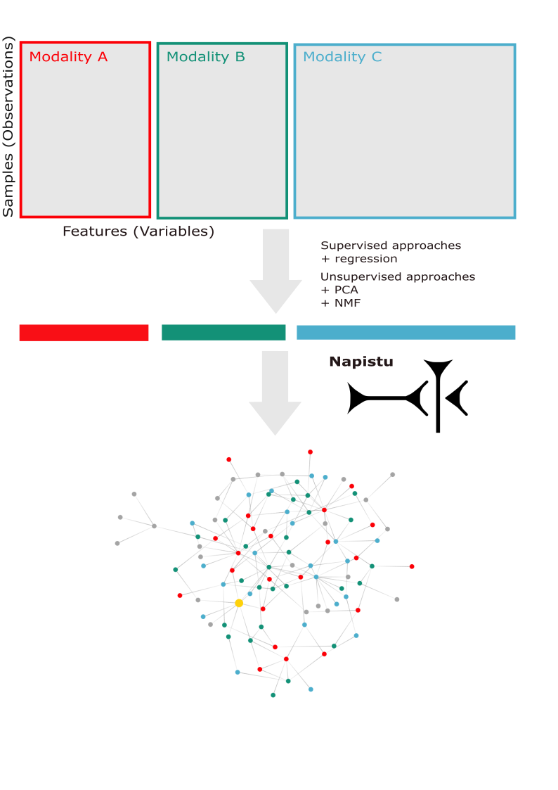
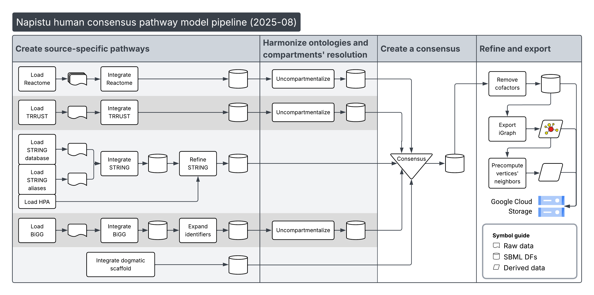
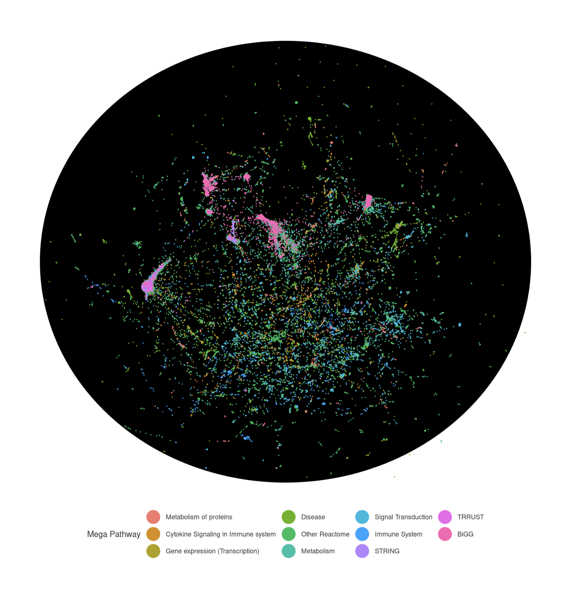
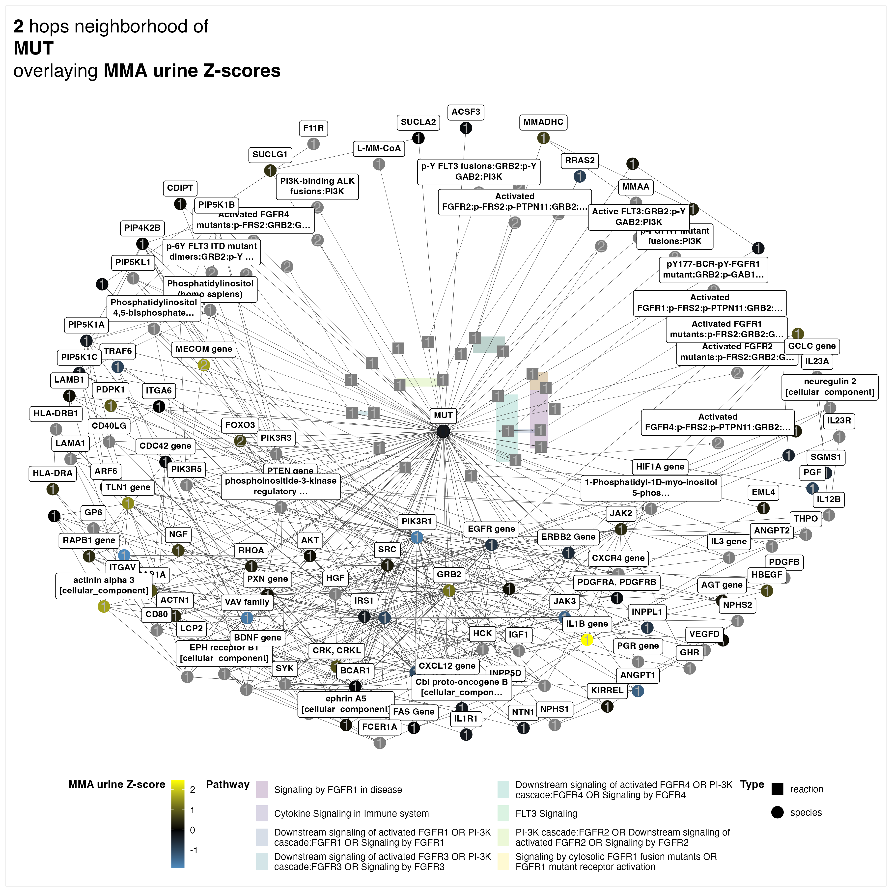
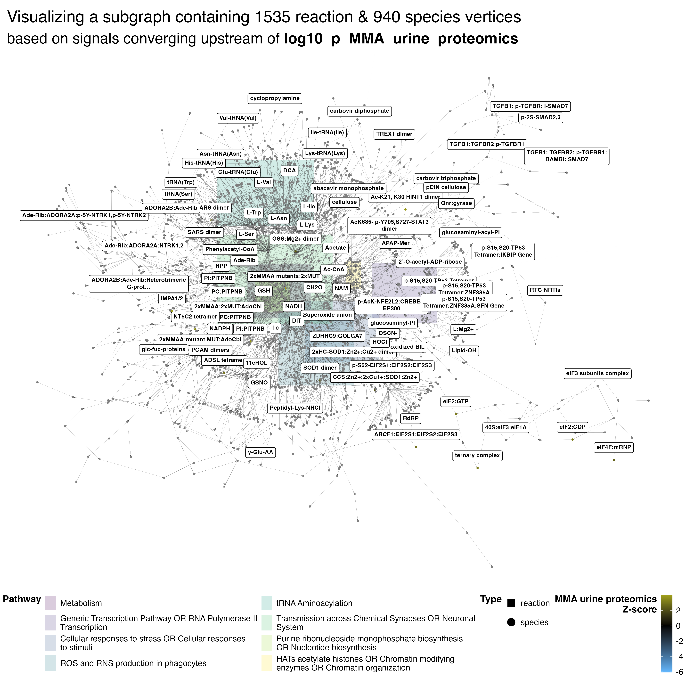

This is part two of a two-part series highlighting **[Napistu](https://github.com/napistu/napistu)**, a new framework for building genome-scale networks of molecular biology and biochemistry and integrating them with high-dimensional data. Using a methylmalonic acidemia (MMA) multimodal dataset as a case study, I'll show how to identify disease-relevant molecular signals and distill them into mechanistic insights through network-based analysis.

## From statistical associations to biological mechanisms

Modern genomics excels at generating lists of disease-associated genes and proteins through statistical analysis. Gene Set Enrichment Analysis (GSEA) and similar approaches can group these genes into functional categories, providing useful biological labels. But what we really want is to move from identifying *what* genes change to understanding *why* they belong together — the kind of mechanistic depth you'd see in Figure 1 of a Cell paper, where molecular components are connected through established biochemistry and molecular biology.

In this post, I'll demonstrate how to achieve this mechanistic depth by overlaying statistical disease signatures onto genome-scale biological networks and using personalized PageRank to trace signals upstream from dysregulated genes to their shared regulatory origins. This approach transforms lists of differentially expressed genes into interconnected regulatory modules, revealing the upstream molecular mechanisms that drive coordinated changes in MMA pathophysiology.

## Napistu's implementation

Napistu makes network biology concepts practical through three core capabilities. First, its data representation faithfully captures regulatory mechanisms by representing genes, metabolites, protein complexes, and drugs as molecular species connected through regulatory interactions and biochemical transformations. Second, it provides methods for translating these pathway representations into regulatory graphs where vertices represent molecular species and edges represent direct regulatory relationships. Third, it enables users to ask sophisticated biological questions of these networks: What is the relationship between two genes? What are the direct and indirect regulators of a molecular target? And as we'll explore in this post, what shared mechanisms unite a set of disease-associated genes?

Throughout this post, I'll use two types of asides to provide additional context without disrupting the main narrative. The green boxes contain biological background and systems biology "inside baseball", while the blue boxes reflect on my experience developing scientific software in the age of AI.

{% include bio-section.html content="
**For biologists:** You'll learn about a broadly applicable open-source framework that could be applied to your biological problems, moving beyond traditional pathway analysis limitations. We'll discover how network propagation reveals unexpected regulatory connections in MMA pathophysiology, connecting MMUT dysfunction to anaplerotic metabolites like glutamine and identifying novel signaling pathway components that weren't apparent from traditional gene set analysis. These findings validate and extend the Forny discoveries while pointing to previously unappreciated therapeutic targets.
" %}



## Series overview

::: {.columns}
::: {.column width="55%"}
**Part 1: Creating Multimodal Disease Profiles** established the foundation by systematically extracting disease-relevant molecular signatures from the Forny et al. methylmalonic acidemia dataset. Through careful batch effect correction and both supervised and unsupervised analyses, I identified coordinated programs of gene and protein expression associated with disease severity measures. This preprocessing created clean, quantitative molecular profiles ready for network integration.
:::

::: {.column width="45%"}

:::
:::

In this second post, I'll contextualize these statistical signals within genome-scale biological networks using Napistu. My goal is to trace disease signals from the symptoms of dysregulation (the differentially expressed genes and proteins) upstream to their shared regulators. I'll accomplish this by first mapping my statistical results onto genes in the biological pathway model, then transferring these signals to vertices in a regulatory graph. Finally, I'll apply personalized PageRank with appropriate null distributions to identify subgraphs enriched for disease signals, revealing the upstream regulatory mechanisms driving MMA pathophysiology.

# Integrating genome-scale networks and genome-wide data

## Environment setup

To reproduce this analysis:

1. Run the first notebook in the series (`creating_multimodal_profiles.qmd`). This will setup both the Python environment and input data for this analysis.
2. Set the paths in the following code block:
    a. `CACHE_DIR` should match the value in `creating_multimodal_profiles.qmd`
    b. `INPUT_DATA_DIR` should be a suitable location for saving the network representations (~4 Gb)
3. Run the notebook and render an html output:
    
    ```bash
    quarto render napistu_network_propagation.qmd
    ```
    
First off, I'll load Python modules, configure paths, set global parameters, and define utility functions.

```{python}
#| label: env_setup

import os
import re
from pathlib import Path
from types import SimpleNamespace

import mudata as md
import numpy as np
import pandas as pd
import seaborn as sns
import matplotlib.pyplot as plt
from IPython.display import display, HTML

from napistu import utils as napistu_utils
from napistu.sbml_dfs_core import SBML_dfs
from napistu.source import unnest_sources
from napistu.gcs import downloads
from napistu.matching import mount
from napistu.network.ng_core import NapistuGraph
from napistu.network import net_propagation
from napistu.network import data_handling
from napistu.network import ng_utils
from napistu.scverse.loading import prepare_anndata_results_df
from napistu.scverse.loading import prepare_mudata_results_df
from napistu.constants import ONTOLOGIES, MINI_SBO_TO_NAME

from shackett_utils.statistics import hypothesis_testing
from shackett_utils.statistics import multi_model_fitting

# setup logging
import logging
logging.basicConfig(level=logging.INFO)
logger = logging.getLogger(__name__)
logging.getLogger('matplotlib.font_manager').setLevel(logging.WARNING)

# File paths and data organization
# All input data should be placed in the SUPPLEMENTAL_DATA_DIR
# Cached results and models will be stored in CACHE_DIR

# paths
PROJECT_DIR = os.path.expanduser("~/napistu_mma_posts")
INPUT_DATA_DIR = os.path.join(PROJECT_DIR, "input")
CACHE_DIR = os.path.join(PROJECT_DIR, "cache")

# inputs
# model to download from GCS and store in NAPISTU_DATA_DIR
NAPISTU_ASSET = "human_consensus"
# H5Mu file containing the optimal model from MOFA+ and regression summaries
OPTIMAL_MODEL_H5MU_OUTFILE = "mofa_optimal_model.h5mu"

# intermediate files
PPR_NULL_CACHE_OUTFILE = "ppr_null_cache.tsv"

# outputs
PPR_RESULTS_OUTFILE = "ppr_results.tsv"
SBML_DFS_W_DATA_OUTFILE = "sbml_dfs_w_data.pkl"
NAPISTU_GRAPH_W_DATA_OUTFILE = "napistu_graph_w_data.pkl"

# Paths to input/output files
OPTIMAL_MODEL_H5MU_PATH = os.path.join(CACHE_DIR, OPTIMAL_MODEL_H5MU_OUTFILE)
PPR_NULL_TMP_PATH = os.path.join(CACHE_DIR, PPR_NULL_CACHE_OUTFILE)
PPR_RESULTS_PATH = os.path.join(PROJECT_DIR, PPR_RESULTS_OUTFILE)
SBML_DFS_W_DATA_PATH = os.path.join(PROJECT_DIR, SBML_DFS_W_DATA_OUTFILE)
NAPISTU_GRAPH_W_DATA_PATH = os.path.join(PROJECT_DIR, NAPISTU_GRAPH_W_DATA_OUTFILE)

# dataset metadata
FORNY_MODALITIES = SimpleNamespace(
    TRANSCRIPTOMICS = "transcriptomics",
    PROTEOMICS = "proteomics"
)

MODALITIES = list(FORNY_MODALITIES.__dict__.values())

# Napistu controlled vocabulary
FORNY_ONTOLOGIES = SimpleNamespace(
    ENSEMBL_GENE = ONTOLOGIES.ENSEMBL_GENE,
    UNIPROT = ONTOLOGIES.UNIPROT
)

FORNY_DEFS = SimpleNamespace(
    # varm table names set in part
    LFS = "LFs",
    # table names used to add data sources to `sbml_dfs`
    MOFA_LFS = "mofa_lfs",
    VAR_LEVEL_RESULTS = "var_level_results",
    # template for is_X variables will be used to restrict vertex permutation
    # to measured proteins/transcripts
    INDICATOR_STR = 'is_{modality}',
    MODALITY_VAR_LEVEL_RESULTS_STR = "{modality}_var_level_results" 
)

MUDATA_ONTOLOGIES = {
    # these dicts indicate the ontology that we want to match against for each modality
    # and indicate that this ontology's identifiers are present in the .var table's index
    FORNY_MODALITIES.TRANSCRIPTOMICS :
        {
            "ontologies" : [FORNY_ONTOLOGIES.ENSEMBL_GENE],
            "index_which_ontology" : FORNY_ONTOLOGIES.ENSEMBL_GENE
        },
    FORNY_MODALITIES.PROTEOMICS :
        {
            "ontologies" : [FORNY_ONTOLOGIES.UNIPROT],
            "index_which_ontology" : FORNY_ONTOLOGIES.UNIPROT
        }
}

# attributes to use for network propagation
LFS_OF_INTEREST = ["LF1", "LF2", "LF3", "LF4", "LF5"]

# regression terms to add from var table
PPR_LINEAR_PHENOTYPES = {"MMA_urine", "OHCblPlus", "case", "responsive_to_acute_treatment"}
PPR_SMOOTH_PHENOTYPES = {"date_freezing", "proteomics_runorder"}

VAR_VARS = list()
for phenotype in PPR_LINEAR_PHENOTYPES:
    VAR_VARS.append(f"est_{phenotype}")
    VAR_VARS.append(f"stat_{phenotype}")
    # using -log10p since normal p- and q-values will underflow
    VAR_VARS.append(f"log10p_{phenotype}")
    VAR_VARS.append(f"q_{phenotype}")
for phenotype in PPR_SMOOTH_PHENOTYPES:
    VAR_VARS.append(f"q_{phenotype}")

STAT_PREFIXES = ["est", "log10p", "q", "stat"]
VAR_METADATA = pd.DataFrame([
  *[{ "phenotype" : "latent factors", "summary" : x, "variable" : x} for x in LFS_OF_INTEREST],
  *[{ "phenotype" : x, "summary" : y, "variable" : f"{y}_{x}"} for x in (PPR_LINEAR_PHENOTYPES | PPR_SMOOTH_PHENOTYPES) for y in STAT_PREFIXES if f"{y}_{x}" in VAR_VARS]
])
VAR_METADATA["summary"] = VAR_METADATA["summary"].str.replace('_', ' ')

# defining variables to add as vertex attributes and how to transform them so
# they are appropriate for personalized pagerank reset probability
ATTRIBUTES_TO_GRAPH_SPEC = [
    {
        "attribute_names": "LF",
        "table_name": FORNY_DEFS.MOFA_LFS,
        "transformation": "square"
    },
    {
        "attribute_names": "^est_",
        "table_name": FORNY_DEFS.VAR_LEVEL_RESULTS,
        "transformation": "square"
    },
    {
        "attribute_names": "^stat_",
        "table_name": FORNY_DEFS.VAR_LEVEL_RESULTS,
        "transformation": "abs"
    },
    {
        "attribute_names": "^log10p_",
        "table_name": FORNY_DEFS.VAR_LEVEL_RESULTS,
        "transformation": "negate"
    },
    {
        "attribute_names": "^q_",
        "table_name": FORNY_DEFS.VAR_LEVEL_RESULTS,
        "transformation": "underflow_guarded_nlog10"
    },
]

ATTRIBUTES_TO_GRAPH_SPEC = ATTRIBUTES_TO_GRAPH_SPEC + [{
    "attribute_names": FORNY_DEFS.INDICATOR_STR.format(modality = m),
    "table_name": FORNY_DEFS.MODALITY_VAR_LEVEL_RESULTS_STR.format(modality = m),
    "transformation": "identity"
} for m in MODALITIES]

# masks from vertex attribute name to modality to use during vertex permutation 
REGEXES_TO_MASKS = { x: FORNY_DEFS.INDICATOR_STR.format(modality = x) for x in MODALITIES }

# utility functions

def underflow_guarded_nlog10(x):
    if x < 1e-12:
        return 1e-12 # underflow guard
    else:
        return -np.log10(x)

CUSTOM_TRANSFORMATIONS = {
    # take the absolute value
    "abs" : lambda x: abs(x),
    "negate" : lambda x: -x,
    # -log10[pvalue]
    "underflow_guarded_nlog10" : underflow_guarded_nlog10,
    "square" : lambda x: x**2
}

def floor_pvalue_by_resolution(p_value, n_samples):
    """
    Floor p-values by resolution.
    """
    
    return (p_value + 1 / n_samples) * (n_samples / (n_samples + 1))

def create_stacked_barplot_seaborn(df):
    """
    Alternative version using seaborn styling
    """
    # Set seaborn style
    sns.set_style("whitegrid")
    
    # Group by measure and sum counts across modalities
    total_counts = df.groupby('variable')['count'].sum().sort_values(ascending=False)
    
    # Create pivot table
    pivot_df = df.pivot_table(index='variable', columns='modality', values='count', fill_value=0)
    pivot_df = pivot_df.reindex(total_counts.index)
    
    # Create the plot
    fig, ax = plt.subplots(figsize=(16, 8))
    
    # Use seaborn color palette
    colors = sns.color_palette("husl", len(pivot_df.columns))
    
    # Plot stacked bars
    pivot_df.plot(kind='bar', stacked=True, ax=ax, color=colors, alpha=0.8)
    
    # Customize
    ax.set_title('Stacked Barplot by Attributes and Modality', fontsize=16, fontweight='bold')
    ax.set_xlabel('Attributes (ordered by total count)', fontsize=12)
    ax.set_ylabel('Count', fontsize=12)
    ax.legend(title='Modality', bbox_to_anchor=(1.05, 1), loc='upper left')
    
    plt.xticks(rotation=45, ha='right')
    plt.tight_layout()
    plt.show()
    
    return fig, ax

def plot_ppr_enrichment_histograms(fdr_controlled_results):

    axes = fdr_controlled_results["p_value"].hist(bins = int(round(N_NULL_SAMPLES/2, 0)), by = fdr_controlled_results["is_enriched"])
    axes[0].set_title("Depleted (False)")
    axes[0].set_xlabel("P-value")
    axes[0].set_ylabel("Count")
    axes[1].set_title("Enriched (True)")
    axes[1].set_xlabel("P-value")

    plt.show()

def reorder_by_rank_sum(df):
    """Reorder rows by sum of ranks (lower sum = better overall rank)"""
    df_num = df.replace('.', pd.NA).apply(pd.to_numeric, errors='coerce')
    max_val = df_num.max().max()
    df_filled = df_num.fillna(max_val + 1)
    rank_sums = df_filled.sum(axis=1)
    return df.loc[rank_sums.sort_values().index]

# constants affecting behavior
N_NULL_SAMPLES = 1000
OVERWRITE = True
```

## Loading MMA molecular profiles

Next, I'll load the results I generated in the previous post (TO DO - link). These are stored in a `MuData` object saved as an `.h5mu` file (you'll see the contents of this object below when I discuss adding attributes to the graph). The only modification I'll make is adding an indicator variable to each modality (`is_transcriptomics` and `is_proteomics`) allowing me to easily track measured transcripts/proteins in downstream analyses.

```{python}
#| label: data_loading
#| output: false

# lets load the Forny results so we can try adding a few different types of tables to the sbml_dfs
mdata = md.read_h5mu(OPTIMAL_MODEL_H5MU_PATH)

# create an indicator which just highlights which modalities are present in the mdata
# this will propagate this indicator to vertices in the graph which is useful for generating
# a mask for constructing vertices' null distributions
ADATA_LEVEL_VARS = dict()
for modality in MODALITIES:
    indicator_var = FORNY_DEFS.INDICATOR_STR.format(modality=modality)
    # add to var table
    mdata[modality].var[indicator_var] = 1
    # indicate that this should be added to the sbml_dfs later
    ADATA_LEVEL_VARS[modality] = [indicator_var]
```

## Loading Napistu data

To make Napistu easy to use, I've added a lightweight test pathway (3 metabolic pathways merged) and a human consensus pathway to Google Cloud Storage (GCS). These pathway representations revolve around two key objects:

- [SBML_dfs](https://github.com/napistu/napistu/wiki/SBML-DFs) which organizes molecular species (genes, metabolites, complexes, drugs) and their relationships (reactions, interactions) as a relational database.
- [NapistuGraph](https://github.com/napistu/napistu/wiki/Napistu-Graphs) which translates the molecular species and reactions into a directed graph.

The human consensus `SBML_dfs` and `NapistuGraph` I will use combine these sources:

- Reactome: human-centric gold-standard cellular physiology and signaling
- BiGG: the Recon3D genome-scale metabolic model
- TRRUST: consensus transcription factor to target relationships
- STRING: undirected physical and functional interactions
- Dogma: a model of cognate relationships between genes, transcripts, and proteins and their relevant systematic identifiers

It was created using the Napistu Python CLI (see the [build pipeline](https://github.com/napistu/napistu/blob/main/dev/create_human_consensus.qmd)) which can be used to build and refine genome-scale pathway representations for most model organisms. Here is an overview of the human consensuses' construction:



I will download and load the consensus pathway from my public GCS bucket, along with its NapistuGraph and a lookup table of systematic identifiers, by running:

```{python}
#| label: napistu_setup

# this will download the sbml_dfs, napistu_graph, and species_identifiers from a public GCS bucket
# or if they already exist in the NAPISTU_DATA_DIR, it will just set the path to the existing asset
sbml_dfs_path = downloads.load_public_napistu_asset(
    asset = NAPISTU_ASSET,
    data_dir = INPUT_DATA_DIR,
    subasset = "sbml_dfs"
)

napistu_graph_path = downloads.load_public_napistu_asset(
    asset = NAPISTU_ASSET,
    data_dir = INPUT_DATA_DIR,
    subasset = "napistu_graph"
)

species_identifiers_path = downloads.load_public_napistu_asset(
    asset = NAPISTU_ASSET,
    data_dir = INPUT_DATA_DIR,
    subasset = "species_identifiers"
)

# ~2 min load
sbml_dfs = SBML_dfs.from_pickle(sbml_dfs_path)

napistu_graph = NapistuGraph.from_pickle(napistu_graph_path)

species_identifiers = pd.read_csv(species_identifiers_path, delimiter = "\t")

ng_utils.validate_assets(
    sbml_dfs = sbml_dfs,
    napistu_graph = napistu_graph,
    identifiers_df = species_identifiers
)
```

Having loaded the key Napistu resources, I'll examine the model composition by counting the number of molecular species from each data source and summarizing the types of regulatory roles represented by graph edges.

```{python}
#| label: napistu_summaries

# generate some simple model summaries
species_sources = unnest_sources(sbml_dfs.species)

species_counts_by_source = (
    species_sources.loc[species_sources["pathway_id"].str.startswith("napistu_data")]
    .value_counts("pathway_id")
    .reset_index()
    .assign(
        pathway_id=lambda x: x['pathway_id'].apply(
        lambda path: Path(path).stem.replace('uncompartmentalized_', '').replace('hpa_filtered_', '')
    )
    )
    .sort_values("count", ascending=False)
    .set_index("pathway_id")
    .T
    .assign(total = sbml_dfs.species.shape[0])
)

display(HTML("Counts of molecular species from each source"))
display(napistu_utils.style_df(species_counts_by_source))

participant_counts = napistu_graph.get_edge_dataframe().value_counts("sbo_term").rename(index=MINI_SBO_TO_NAME).to_frame().T
display(HTML("Counts of reaction species by role"))
display(napistu_utils.style_df(participant_counts))
```

The model statistics reveal the comprehensive scope of this network representation. The consensus model integrates over 38,000 molecular species including ~19,000 proteins (as seen from the gene-centric string and dogma sources), and another 19,000 metabolites and complexes (primarily from Reactome and the BiGG Recon3D model). The graph contains nearly 4 million molecular interactions most of which are physical or functional interactions from STRING while ~92,000 have a deeper mechanistic annotation (e.g., TF -> target, enzyme -> substrate).

<div align="center">

</div>

While this genome-scale view shows the overall network structure, I can zoom into any region to examine molecular interactions at high resolution. For example, I can explore the molecular neighborhood of MMUT (shown as "MUT" in the network) to identify its upstream regulators and downstream targets. This local view reveals how MMUT connects to both regulatory genes (like AKT and IGF1) and metabolites (like methylmalonyl-CoA [shown as L-MM-CoA]), illustrating the integration of regulatory and metabolic networks. 

{% include bio-section.html content="
While vertex names may sometimes appear unexpected due to systematic identifier mapping, all connections are based on reliable database identifiers ensuring accurate molecular relationships. Annotations are tracked in `Identifiers` objects which track the the identifiers across multiple ontologies related an entity. These annotations also incorporate `[SBML](https://sbml.org/)`'s biological qualifiers annotations which allow for relations like `BQB_IS` for defining relationship, `BQB_HAS_PART` for parts of a complex, or `BQB_IS_DESCRIBED_BY` for adding information about the publications describing a reaction. Napistu leverages these annotations to merge data sources when creating a consensus model and they are also how I can easily integrate high-dimensional datasets with Napistu's pathway representations.
" %}

<div align="center">

</div>

{% include bio-section.html content="
I created this visualization and the subgraph figure you'll see later using the results from this post. If you're interested in generating visualization like this take a look at: [network_visualzation.qmd](https://github.com/napistu/napistu-scrapyard/blob/main/applications/forny_2023/network_vis.qmd()). While Napistu is primarily a Python framework, the companion R package [napistu.r](https://github.com/napistu/napistu-r) is designed for visualizing Napistu networks. It leans heavily on [ggraph](https://ggraph.data-imaginist.com/) for grammer-of-graphics compatible network visualization and `reticulate` as an R-to-Python bridge for interacting with Napistu's Python data and functions. 
" %}

# Adding data to networks

To use an 'omic dataset in Napistu, I want to:
1. mount the dataset on the pathway `sbml_dfs`. This entails:
    - matching systematic identifiers between the dataset and pathway to connect 'omic features to Napistu `species`.
    - resolve many-to-1 mappings (e.g., where 2+ features match the same species).
    - create a table with unique species ids as the index with variable from the dataset.
    - add this to the `species_data` attribute of the `sbml_dfs`. Multiple tables and/or datasets can be added to `species_data`.
2. pass variables from one or more `species_data` tables to a `napistu_graph`'s vertices with `net_create._add_graph_species_attribute`. Variables can be transformed (e.g., to make them non-negative for personalized pagerank) at this point (or this could be done before step (1)).
3. use these vertex attributes for downstream analysis (e.g., using it in the `reset_proportional_to` parameters of PPR).

## Data to `SBML_dfs`

To figure out what results I'm interested in digging into further with network methods I can first take a look at the actual `MuData` object I created in previous analysis. From this summary their are `MuData`-level attributes like the Multi Omic Factor Analysis (MOFA) results, and modality-level `AnnData` attributes including sample attributes (`obs`), feature attributes (`var`), measurements (`X` and `layers`) and various other tensors defined over features or samples (`obsm`, `varm`). 

```{python}
#| label: mdata

mdata
```

Any of these attributes which is defined over features (MuData or AnnData) level `var`, `varm`, `X`, or `layers` can be easily "mounted" onto a NapistuGraph using workflows which abstract away some of the minutiae of identifier mapping, disambiguation, and complex membership. Three inputs are supported:

- `mudata.MuData` objects containing multiple `AnnData` objects where `var` and `varm` attributes can be defined across multiple datasets.
- `anndata.AnnData` objects where the `var` table provided identifiers, and feature-level summaries come from either the `var`, `varm` or `X` tables.
- `pd.DataFrame` objects which including 1+ systematic identifiers

Here, I'll provide a detailed example of mounting results from a MuData object, while highlighting how one could easily add loose results from a DF or AnnData object.

### Adding latent factors

In the previous post, I used Multi-Omics Factor Analysis (MOFA) to decompose the dataset into 30 covarying factors. The factor loadings are stored as a 13.9K x 30 matrix `mdata.varm["LFs"]`.

The `prepare_mudata_results_df` function prepares this tensor for Napistu by pulling one or more modality-specific systematic identifiers from `.var` attributes and combining them the modalities factor loadings. The extracted results are returned as a dict since I may want to approach combining results across modalities in several ways.

```{python}
#| label: extracting_profiles_lfs
#| output: false

mofa_lfs = prepare_mudata_results_df(
    mdata,
    mudata_ontologies=MUDATA_ONTOLOGIES,
    table_type="varm",
    table_name=FORNY_DEFS.LFS, # this would be autodetected
    results_attrs=LFS_OF_INTEREST,
    table_colnames=[f"LF{i}" for i in range(1, mdata.varm[FORNY_DEFS.LFS].shape[1] + 1)]
)

for modality in MODALITIES:
    display(HTML(f"<h5>Extracted latent factors for {modality}</h5>"))
    display(napistu_utils.style_df(mofa_lfs[modality].sample(5)))
```

To add these results to an `SBML_dfs` object involves creating a `species_data` pd.DataFrame with 0-1 rows for each distinct molecular species in the model. The molecular species themselves are associated with various genic and molecular ontologies (`ensembl`, `uniprot`, `entrez`, `uniprot`, among others). Napistu supports distinguishing genes, transcripts, and proteins as distinct molecular species (`dogmatic` mode) but the model we loaded above ignores this distinction and genes, transcripts, and proteins are merged into a single molecular species. 

So, adding data to the pathway representation involves both merging based on identifiers but also handling ambiguity (how do I handle a transcript and protein mapping to the same species; what happens if distinct proteins map to the same species). These issues are addressed by the `mount.bind_dict_of_wide_results` function. Here, I'll stagger the results to maintain separate attributes for latent factors depending on whether they pertain to transcripts or proteins.

```{python}
#| label: binding_lfs
#| output: false

mount.bind_dict_of_wide_results(
    sbml_dfs,
    mofa_lfs,
    FORNY_DEFS.MOFA_LFS,
    strategy = "stagger",
    species_identifiers = species_identifiers,
    # ontologies were already renamed to the controlled vocabulary in prepare_mudata_results_df()
    ontologies = None,
    # ignored because species_identifiers is provided
    dogmatic = False,
    # for clarity; default is True
    inplace = True,
    verbose = False
)

display(napistu_utils.style_df(sbml_dfs.species_data[FORNY_DEFS.MOFA_LFS].head(5)))
```

### Adding statistical summaries and modality masks 

```{python}
#| label: binding_results_to_sbml_dfs
#| output: false
#| warning: false

# now we can add .var attributes from the mdata
diffex_results = prepare_mudata_results_df(
    mdata,
    mudata_ontologies=MUDATA_ONTOLOGIES,
    table_type="var",
    results_attrs=VAR_VARS,
    level = "adata"
)

mount.bind_dict_of_wide_results(
    sbml_dfs,
    diffex_results,
    FORNY_DEFS.VAR_LEVEL_RESULTS,
    strategy = "stagger",
    species_identifiers = species_identifiers,
    verbose = False
)

for modality in MODALITIES:
    anndata_results_df = prepare_anndata_results_df(
        mdata[modality],
        table_type="var",
        index_which_ontology = MUDATA_ONTOLOGIES[modality]["index_which_ontology"],
        results_attrs=ADATA_LEVEL_VARS[modality]
    )

    mount.bind_wide_results(
        sbml_dfs,
        anndata_results_df,
        FORNY_DEFS.MODALITY_VAR_LEVEL_RESULTS_STR.format(modality = modality),
        species_identifiers = species_identifiers,
        ontologies = MUDATA_ONTOLOGIES[modality]["ontologies"]
    )
```

## Adding attributes to a graph

Now, I can pass attributes of interest from species_data tables to the Napistu graph object. I could do this with a flexibly low-level interface, the `NapistuGraph` `set_graph_attrs` method, which also supports adding information to edges. But, here I'll leverage the more limited, but (relatively) user-friendly function: `data_handling.add_results_table_to_graph()`.

### Creating an appropriate graph with data attributes.

{% include bio-section.html content="
When using one of the `SBML_dfs` loaded from GCS users can generally rely on the `NapistuGraph` that is bundled with it. A few properties of these graphs are that they are directed (though reversible reactions like those of STRING interactions will exist as a pair of forward and reverse edges), laid out using the "regulatory" wiring approach where participants in a reaction are arranged using a tiered approach (regulators -> catalysts -> substrates -> reactions -> products), and uses sensible strategies for edge weighting. The only modification to this network that I'll need to make to apply for this analysis is reversing its edges. This will allow signals to flow from effects to their upstream causes. 
" %}

Once I have an appropriate network I can pass attributes from `species_data` to vertices using `add_results_table_to_graph`. I'll do this by specifying the attributes to use and how to transform them to make them suitable for PPR (non-negative, where larger values represent stronger signals).

```{python}
#| label: set_graph_attributes
#| output: false
#| warning: false

# create a copy of the graph
napistu_graph.reverse_edges()
assert napistu_graph.is_reversed

for attr_to_graph in ATTRIBUTES_TO_GRAPH_SPEC:
    
    data_handling.add_results_table_to_graph(
        napistu_graph,
        sbml_dfs,
        attribute_names = attr_to_graph["attribute_names"],
        table_name = attr_to_graph["table_name"],
        transformation = attr_to_graph["transformation"],
        custom_transformations = CUSTOM_TRANSFORMATIONS
    )

napistu_graph.vs[0].attributes()
```

# Network propagation with Personalized PageRank (PPR)

To connect gene-level changes to their common regulators we'll apply Personalized PageRank to each of the biological vertex attributes we added to the `NapistuGraph`. The PageRank algorithm conceptually involves adding a signal to a random vertex, then having the signal flow to a child node (w/ probability $\alpha$) or resetting to another random vertex (w/ probability $1-\alpha$). Personalized pagerank involves "personalizing" this process by resetting the algorithm to vertices based on vertices `reset probability` (a probability mass function defined over all vertices). Repeating this random walk with reset many times results in the signal having visited hub vertices many times. The actual PageRank algorithm finds the stationary distribution of this process using some slick linear algebra - power iteration to find the stationary distribution and sparse matrix storage and operations. 

This lovely [blog post](https://www.r-bloggers.com/2014/04/from-random-walks-to-personalized-pagerank/) by Stefan Weigert provides a more thorough overview of PPR. Fore xample, here is Stefan's visualization of a random walk following the PPR process which really nails the intuition for me:

.

I've set myself up for applying PPR above because I have a set of attributes that can each be treated as a reset probability distribution (following L1 normalization). This involved some ad hoc transformations (e.g., converting from log10 p-values to -log10 p-values; or taking the square of effect sizes) which were sensible but ideally I could learn relevant transformations rather than assuming them *a priori*.

```{python}
#| label: select_ppr_attributes
#| output: false

annotated_vertices = napistu_graph.get_vertex_dataframe()

# find valid attributes - numeric + 1+ non-zero values
invalid_attributes = [x for x in annotated_vertices.columns if annotated_vertices[x].dtype not in ["float64", "int64"] or annotated_vertices[x].nunique() == 1]
valid_attributes = [x for x in annotated_vertices.columns if x not in invalid_attributes]

logger.info(f"Invalid attributes: {invalid_attributes}")
logger.info(f"Valid attributes: {valid_attributes}")

# create masks for each modality
assert [x in valid_attributes for x in REGEXES_TO_MASKS.values()]
valid_attributes = list(set(valid_attributes) - set(REGEXES_TO_MASKS.values()))

ppr_results = net_propagation.net_propagate_attributes(
    napistu_graph,
    attributes = valid_attributes,
    propagation_method = "personalized_pagerank",
    additional_propagation_args = { "damping": 0.85 }
)
```

## Controlling for PPR's biases

While PPR identifies the vertices where my initial biological signals converge, this convergence will be naturally biased by the connectivity of the graph concentrating in highly connected hub nodes. I can see this by looking at the vertices with the highest median PPR value across all of the attributes I used:

```{python}
#| label: summarize_connectivity_biases

top_5_by_median_ppr = (
    ppr_results.median(axis=1)
    .sort_values(ascending=False)[0:5]
    .rename("median PPR")
    .to_frame()
    .merge(
        annotated_vertices[["name", "node_name"]],
        left_index = True,
        right_on = "name"
    )
)
top_5_by_median_ppr["degree"] = napistu_graph.degree(top_5_by_median_ppr.index.tolist())

display(napistu_utils.style_df(top_5_by_median_ppr.reset_index(drop = True)))
```

To move forward, I need to address this bias. It arises from two factors, *topological bias*, and *ascertainment bias*.

The topological bias when applying PPR arises because certain regions of the network are denser; and, the in- and out-degree of vertices and the local connectivity of the network in general can cause arbitrary signals to pool in particular regions of the network. This is a broadly appreciated problem in network analysis. To combat this bias I can compare individual vertices to null distributions constructed by randomizing the network. Several types of null distributions are included in Napistu - those which are most relevant for addressing topological biases are the non-parameteric `vertex_permutation` or the `parametric_null`.
    
Ascertainment bias is an issue because the experiment only measured a subset of vertices in the network and this will also naturally pool signal in particular regions of the network. For example, if I were to apply network propagation to the results from a metabolomics experiment the signals would naturally be concentrated in central carbon metabolism. To address this I want to constrain the null randomization to only permute/resample signals from vertices which are actually defined for the attribute. In the case of metabolomics this would mean shuffling metabolite-level summaries and reapplying network propagation to assess whether the signal converged on subnetworks more robustly in observed vs null statistics.

Accommodating both of these points I will generate `N_NULL_SAMPLE` null distributions of PPR scores (over vertices). Each of these nulls is created by using `vertex_permutation` to shuffle reset probabilities over the vertices where the attribute was measured using the `is_transcriptomics` and `is_proteomics` flags. Next, I can compare each observed PPR value (for a particular vertex and attribute) to the `N_NULL_SAMPLE` null values using its quantile as a non-parametric p-value. Generally I am interested in right-tailed p-values because I am interested in subgraphs which are enriched for attribute-level signals rather than those that are depleted for signal (the left tail). The issue here is that strong biological signals will indeed enriched signals in a subset of vertices but they will also naturally deplete signals in other regions of network space. To account for this fact I can do a few things:

1. calculate two-tailed p-values based on the null quantiles which bake in both significant enrichments and depletions.
2. flag vertices which are in the left (depleted) and right (enriched) tail so that we can filter to vertices which are statistically significantly enriched
3. apply FDR control separately on the depleted and enriched p-values. The depletion signals are actually STRONGER than the enrichments (lower pi0) so applying FDR control to all p-values would be anti-conservative q-values for enriched signals.
    
First, I'll calculate the PPR null distributions and cache the results (which took me about 45 minutes to generate with 100 null permutations [which is on the low side]):
    
```{python}
#| label: ppr_null_distribution
#| output: false

attr_masks = dict()
for attr in valid_attributes:
    for regex, mask in REGEXES_TO_MASKS.items():
        if re.search(regex, attr):
            attr_masks[attr] = mask
            continue

    if attr not in attr_masks:
        logger.info(f"Could not find a modality-specific mask for {attr}; using {attr} as its own mask")
        # default behavior is to use the attribute as its own mask but adding it anyways to be explicit
        attr_masks[attr] = attr
        
if os.path.isfile(PPR_NULL_TMP_PATH) and not OVERWRITE:
    logger.info(f"Loading PPR nulls from cache at {PPR_NULL_TMP_PATH}")
    ppr_with_nulls = pd.read_csv(PPR_NULL_TMP_PATH, sep="\t", index_col=0)
else:
    logger.info(f"Calibrating PPR enrichments by permuting vertex attributes among masked vertices")
    ppr_with_nulls = net_propagation.network_propagation_with_null(
        napistu_graph,
        attributes = valid_attributes,
        mask = attr_masks,
        propagation_method = "personalized_pagerank",
        additional_propagation_args = { "damping": 0.85 },
        null_strategy = "vertex_permutation",
        n_samples = N_NULL_SAMPLES,
        verbose = True    
    )   

    logger.info(f"Saving PPR nulls to cache at {PPR_NULL_TMP_PATH}")
    ppr_with_nulls.to_csv(PPR_NULL_TMP_PATH, sep="\t")
```

## Identifying enriched subgraphs

Next, I will calculate p-values and q-value stratified by attribute and distinguishing positive and negative enrichments. Currently this uses BH since all of the Python implementations of q-value (Storey & Tibshirani) that I've tried are flawed.

```{python}
#| label: ppr_significance
#| output: false

# name index to vertex_id
tall_ppr_enrichments = (
    ppr_with_nulls
    .reset_index()
    .rename(columns={"index": "vertex_name"})
    .melt(id_vars=["vertex_name"], var_name="attribute", value_name="ppr_null_quantile")
    .assign(p_value = lambda x: hypothesis_testing.quantile_to_pvalue(x["ppr_null_quantile"], "two-tailed"))
    .assign(is_enriched = lambda x: x["ppr_null_quantile"] > 0.5)
    # correct for 0 p-values by flooring based on the # of null samples
    .assign(p_value = lambda x: floor_pvalue_by_resolution(x["p_value"], N_NULL_SAMPLES))
    .assign(nulls_gt_observed = lambda x: ((1 - x["ppr_null_quantile"])*N_NULL_SAMPLES).fillna(-1).astype(int))
)

# combine observed and null summaries
tall_ppr_results =  (
    ppr_results
    .reset_index()
    .rename(columns={"index": "vertex_name"})
    .melt(id_vars=["vertex_name"], var_name="attribute", value_name="ppr_score")
    .merge(tall_ppr_enrichments, on=["vertex_name", "attribute"])
    .dropna(subset=["p_value"])
)

fdr_controlled_results = multi_model_fitting.control_fdr(
    tall_ppr_results,
    grouping_vars = ["attribute", "is_enriched"],
    require_groups = True
)

plot_ppr_enrichment_histograms(fdr_controlled_results)
```

From these p-value histograms I can see that there are vertices which are enriched and depleted for my signals and the depletions are particularly pronounced. This observation is why I stratified enrichments and depletions when calculating FDR. 

To explore the subnetworks enriched for each attribute I can filter to just the vertices which are significantly enriched (q < 0.1) for an attribute. I can tally these entries to look at the total number of vertices enriched for each modality:  

```{python}
#| label: discovery_counts

n_enriched_vertices = fdr_controlled_results.query("is_enriched == True").query("q_value < 0.1").value_counts("attribute")

# add back zeros
missing_attributes = set(fdr_controlled_results["attribute"].unique()) - set(n_enriched_vertices.index.tolist())
missing_attributes

n_enriched_vertices = (
    pd.concat([
        n_enriched_vertices,
        pd.Series({attr: 0 for attr in missing_attributes}).rename("count")
    ])
)

# reformat the attributes to include modality and measure
attr_metadata = dict()
for key in n_enriched_vertices.index.tolist():
    for mod in MODALITIES:
        # match str
        if re.search(mod, key):
            attr_metadata[key] = {
                "modality" : mod,
                "variable" : re.sub(f"_{mod}$", "", key)
            }
            break

    if key not in attr_metadata:
        attr_metadata[key] = {
            "modality" : "unknown",
            "variable" : key
        }

attr_metadata_df = (
    pd.DataFrame(attr_metadata).T
    .merge(VAR_METADATA, on = "variable", how = "left")
).assign(attribute=lambda x: x.apply(lambda row: f"{row['variable']}_{row['modality']}", axis=1)).set_index("attribute")

attr_signif_counts = pd.concat(
    [
        n_enriched_vertices,
        attr_metadata_df
    ],
    axis = 1
)

fig, ax = create_stacked_barplot_seaborn(attr_signif_counts)
```

## Top signal convergences by attribute

I cast a wide net by a broad range of phenotypes and their summaries to network representations including multiple disease phenotypes (OHCblPlus as a read-out of enzymatic activity, urine MMA levels as a readout of metabolic burden).

```{python}
#| label: ppr_bio

ppr_signif_w_metadata = (
    fdr_controlled_results
    .merge(attr_metadata_df, on = "attribute", how = "left")
    # remove q-value based ranking
    .query('summary != "q"')
    # sort each attribute in ascending order by q-value and provide the rank, handling ties appropriately
    .assign(rank = lambda x: x.groupby(["attribute", "is_enriched"])["q_value"].rank(method="min", ascending=True))
    # replace rank with . if q-value is above 0.1
    .assign(rank = lambda x: x["rank"].where((x["q_value"] <= 0.1) & (x["is_enriched"] == True), "."))
    # similar approach but work with quantiles relative to null
    .assign(display_nulls_gt_observed = lambda x: x["nulls_gt_observed"].where((x["q_value"] <= 0.1) & (x["is_enriched"] == True), "."))
)

# loop through
phenotypes_of_interest = PPR_LINEAR_PHENOTYPES
for phenotype in phenotypes_of_interest:

    phenotype_ppr_results = ppr_signif_w_metadata.loc[ppr_signif_w_metadata["phenotype"] == phenotype]

    # find top N vertices for each attribute 
    top_phenotype_vertices = phenotype_ppr_results.query("q_value < 0.1 & is_enriched == True").sort_values(["q_value", "ppr_score"], ascending = [True, False]).groupby("attribute").head(5)["vertex_name"].unique()

    top_phenotype_stats = phenotype_pivot = (
        phenotype_ppr_results.query("vertex_name in @top_phenotype_vertices").merge(
            annotated_vertices[["name", "node_name", "node_type"]],
            left_on = "vertex_name",
            right_on = "name"
        )
        #.assign(rank=lambda x: x["rank"].apply(lambda val: str(int(float(val))) if val != "." else val))
        #.pivot_table(index = ["modality", "summary"], columns = "node_name", values = "rank", aggfunc="first")
        .pivot_table(index = ["modality", "summary"], columns = "node_name", values = "display_nulls_gt_observed", aggfunc="first")
        .T
    )

    # Apply to your table
    reordered_table = reorder_by_rank_sum(top_phenotype_stats)

    display(HTML(f"<h4>Association ranks for {phenotype}</h4>"))
    display(napistu_utils.style_df(reordered_table))
```



{% include ai-aside.html content=" 
I made choices in terms of creating these pathway both in terms of sources to include, and how to represent them (e.g., do we merge cognate genes, transcripts, and proteins? should we merge compartments? should we drop cofactors?). More choices went into how to translate the `SBML_dfs` into a graph (e.g., how to weight and deduplicate edges). Many of these decisions are opinionated but easily defensible (like we remove cofactors because otherwise "water" would be treated the largest regulatory hub (true perhaps, but not particularly actionable)), others are clearly heuristic (like what should the relative weight be between an enzyme modifying its substrate and a high confidence protein-protein interaction). In the future, I believe that this framework could be particularly impactful if we could expose information with fewer assumptions baked in. The core data of an `SBML_dfs` object could be organized as MCP endpoints to serve as inductive priors for AI cell models. While, source-specific support for interactions could be comprehensively added to graph's edges and combined with graph neural networks to link regulators and their targets.
" %}
