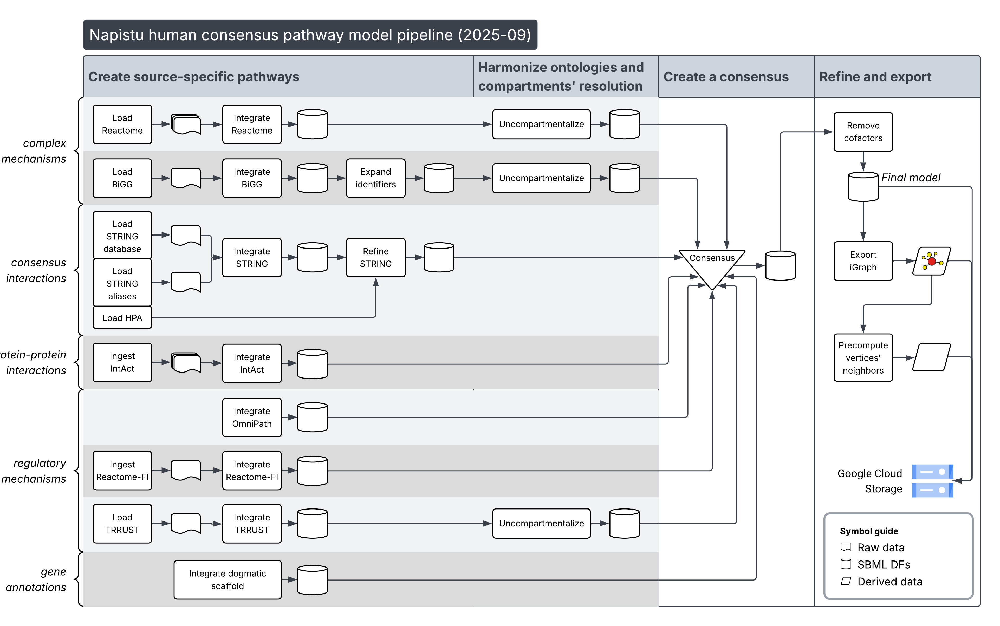
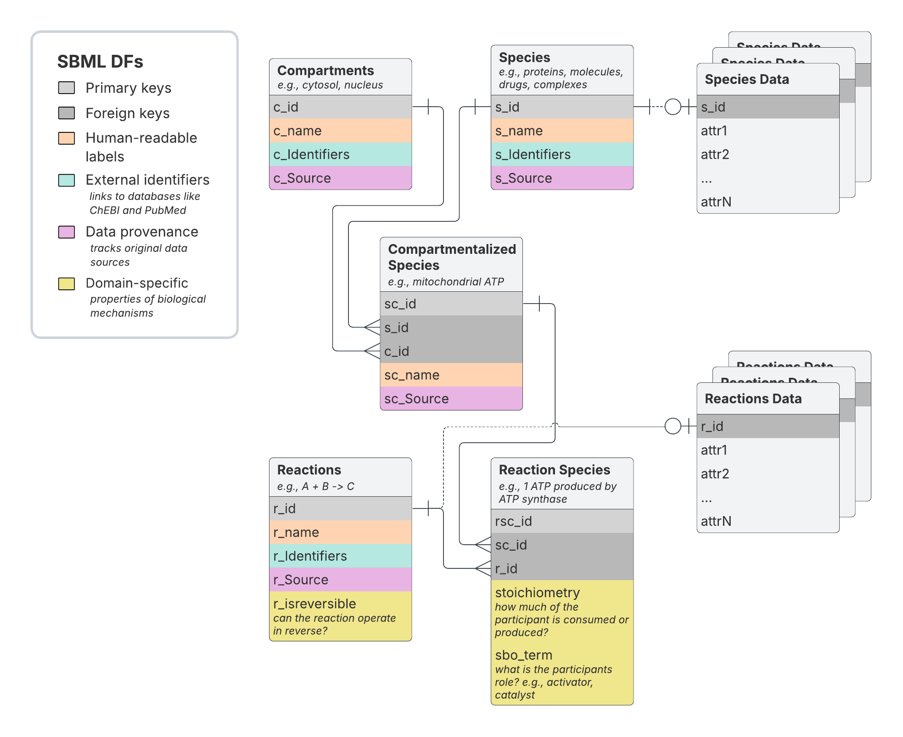

In this post, I'll provide an overview of the recently updated Napistu human consensus pathway model. This version, aggregates molecular interactions from eight pathway sources, so I nicknamed it the **Octopus**. To mark this occasion, this post will provide:

- an overview of the octopus model and its construction
- a summary of the model's properties
- an overview of the information contributed from individual data sources
- my plans for exploring the internal consistency and value of individual sources using `PyG`.

<!--more-->


The model itself is distributed as a set of related Napistu assets tarred together. The core components are the two major Napistu data structures:

- [`SBML_dfs`](https://github.com/napistu/napistu/wiki/SBML-DFs): An in-memory relational database organizing molecular species (genes, metabolites, complexes, drugs) and their relationships (reactions, interactions). I'll provide a thorough review of this format below.
- [`NapistuGraph`](https://github.com/napistu/napistu/wiki/Napistu-Graphs): A directed graph representation of the same network, translating molecular species and reactions into a graph structure for downstream analysis.

## 🐙🐙 Building the Octopus 🐙🐙

I created the Octopus using the Napistu CLI, which allows users to process individual pathway sources (covering most model organisms), merge them into consensus models, and translate them into genome-scale molecular networks. The actual build process is rudimentary and simply involves just running a [Quarto notebook](https://github.com/napistu/napistu/blob/main/dev/create_human_consensus.qmd). This works fine for my needs, but if Napistu gains traction in the broader research community, the project would benefit from a dedicated workflow manager like NextFlow, WDL, or a cloud friendly service like Cloud Composer-managed Airflow.

The build process for the Octopus, illustrated below, involves the following steps:

1. Ingesting data source specific content and formatting as an `SBML_dfs` object
2. Unifying compartmentalization resolution so all models are either uncompartmentalized or compartmentalized (and compartmentalized models are defined with similar specificity). The Octopus is uncompartmentalized so this step is easy.
3. Merging the `SBML_dfs` objects into a single consensus `SBML_dfs`
4. Removing cofactors so molecules like water do not show up as hub regulators
5. Translating the `SBML_dfs` object into a `NapistuGraph` object
6. Exporting derived summaries like precomputed distances between molecular species
7. Aggregating the final `SBML_dfs`, `NapistuGraph`, and other derived summaries into a single artifact and uploading it to Google Cloud Storage (GCS)



bio aside?
- on compartmentalization
- from compartments -> no compartments; from no compartments -> compartments

## Follow Along!

### Environment setup

To follow along with the code in this post, you'll need a Python environment with the `napistu` package installed. Here is a simple setup for creating a `venv`:

1. Install [uv](https://docs.astral.sh/uv/#highlights) (or just use `pip` install)

2. Setup a Python environment:

```bash
uv venv --python 3.11
source .venv/bin/activate

# Core dependencies
uv pip install "napistu==0.6.3"
# if you'd like to render the notebook, you'll need to install these additional dependencies
uv pip install seaborn ipykernel nbformat nbclient
python -m ipykernel install --user --name=blog-staging
```

3. Download the [`octopus_network.qmd`](https://github.com/shackett/shackett/blob/master/posts/posted/octopus_network.qmd) notebook (or just copy and paste the relevant code blocks).

4. Configure `data_dir` below to a path where you're comfortable saving the consensus `SBML_dfs` model.

### Configuring the Python notebook

```{python}
#| label: env_setup

import os
from pathlib import Path

import seaborn as sns
import matplotlib.pyplot as plt

from napistu.gcs import downloads
from napistu.sbml_dfs_core import SBML_dfs
from napistu.network.ng_core import NapistuGraph
from napistu import utils as napistu_utils

# globals
DATA_DIR = "napistu_data"
ASSET = "human_consensus"
VERSION_TAG = "20250916"
INPUT_SBML_DFS_SUMMARIES_URL = "x"

# utils
def simple_pd_heatmap(df, plot_title):
    # Create the heatmap
    plt.figure(figsize=(10, 8))
    sns.clustermap(df, 
                annot=True,  # Show values in cells
                cmap='Blues', 
                fmt='d',  # Integer format for annotations
                cbar_kws={'label': "Counts"})
    plt.title(plot_title)
    plt.tight_layout()
    plt.show()
```

## Data sources

To provide a sense of how this works, I'll first discuss the [`SBML_dfs`](https://github.com/napistu/napistu/wiki/SBML-DFs) format itself and then highlight how the consensus module merges them. 

### Overview of the `SBML_dfs` pathway representation

The core `SBML_dfs` data representation involves five tables linked by with primary key - foreign key relationships.

- **Compartments**: One row per distinct compartment (e.g., cytosol, nucleoplasm). For uncompartmentalized moodels, there only a single compartment, "cellular component", by convention.
- **Species**: One row per distinct molecular species. These could be proteins, metabolites, complexes, drugs, etc.
- **Compartmentalized Species**: One row for each compartment where a species exists.
- **Reactions**: One row per distinct reaction [defined by reaction species]. These could be metabolic reactions, complex formation reactions, undirected physical/functional interactions, etc.
- **Reaction Species**: One row for each compartmentalized species acting in a given reaction with a specific role (e.g., substrate, interactor, catalyst, inhibitor, etc.).

Additional optional tables are used to store additional molecule- or reaction-level annotations which don't fit into the core schema:

- **Species Data**: An optional dictionary containing a set of tables with molecular species-specific quantitative attributes.
- **Reactions Data**: An optional dictionary containing a set of tables with reaction-specific quantitative attributes.

### Source descriptions

Each data source is formatted as a separate `SBML_dfs` object encapsulating its molecular species, their interactions, and any quantitative data.

TO DO - update
- **Reactome** is a human gold-standard pathway database
- **BiGG/Recon3D** is one of the most comprehensive human genome-scale metabolic models, encompassing
- **STRING** is a database of undirected physical and functional interactions
- **IntAct** is a database of directed physical and functional interactions
- **Reactome-FI** is a database of directed physical and functional interactions
- **OmniPath** is a database of directed physical and functional interactions
- **TRRUST** is a database of directed physical and functional interactions
- **Dogma** is a database of directed physical and functional interactions

To provide a side-by-side comparison of these sources, I'll load a few simple summaries from each source's `SBML_dfs` and aggregate them into table's that reveal the complementary nature of each source.

I crated these summarizing by 
For transparency, these summaries were generated with this snippet:

```{python}
#| eval: false

from napistu import consensus
from napistu.sbml_dfs_core import SBML_dfs
from napistu import utils

sbml_dfs_uris = [
    # mechanisms
    "napistu_data/human_consensus/cache/reactome/reactome.pkl",
    "napistu_data/human_consensus/cache/bigg.pkl",
    # consensus interactions
    "napistu_data/human_consensus/cache/hpa_filtered_string.pkl",
    # PPIs
    "napistu_data/human_consensus/cache/intact.pkl",
    # regulatory mechanisms
    "napistu_data/human_consensus/cache/omnipath.pkl",
    "napistu_data/human_consensus/cache/reactome_fi.pkl",
    "napistu_data/human_consensus/cache/trrust.pkl",
    # gene annotations
    "napistu_data/human_consensus/cache/dogma_sbml_dfs.pkl",
]

sbml_dfs_list = [SBML_dfs.from_pickle(uri) for uri in sbml_dfs_uris]

# reorganize as a list and table containing model-level metadata from the individual SBML_dfs
sbml_dfs_dict, pw_index = consensus.prepare_consensus_model(sbml_dfs_list)
sbml_dfs_dict_summaries = {k: v.get_sbml_dfs_summary() for k, v in sbml_dfs_dict.items()}
utils.save_json("/tmp/octopus_input_sbml_dfs_summaries.json", sbml_dfs_dict_summaries)
# > manually moved to `INPUT_SBML_DFS_SUMMARIES_URL`
```

```{python}
#| label: n_entity_types

import pandas as pd
from napistu import utils

sbml_dfs_dict_summaries = utils.load_json("/tmp/octopus_input_sbml_dfs_summaries.json")
entity_type_counts = (
    pd.DataFrame({k: v["n_entity_types"] for k, v in sbml_dfs_dict_summaries.items()})
    .T
    .sort_index(axis = 1)
)

utils.show(entity_type_counts)
```

### Source comparisons

```{python}
from napistu.ontologies.constants import SPECIES_TYPE_PLURAL

(
    pd.DataFrame({k: v["dict_n_species_per_type"] for k, v in sbml_dfs_dict_summaries.items()})
    .astype('Int64')
    .fillna(0)
    .T
    .sort_index(axis = 1)
    .rename(columns = SPECIES_TYPE_PLURAL)
)
```


## How does Napistu merge data sources?

As you can see from the build process, the consensus module is the key to building a multi-source pathway representation. Since I'll be picking apart the full Octopus model into its source-level components, I'll first provide an overview of the consensus module which pulls them all together.

To provide a sense of how this works, I'll first discuss the [`SBML_dfs`](https://github.com/napistu/napistu/wiki/SBML-DFs) format itself and then highlight how the consensus module merges them. 

### Overview of the `SBML_dfs` pathway representation

The core `SBML_dfs` data representation involves five tables linked by with primary key - foreign key relationships.

- **Compartments**: One row per distinct compartment (e.g., cytosol, nucleoplasm). For uncompartmentalized moodels, there only a single compartment, "cellular component", by convention.
- **Species**: One row per distinct molecular species. These could be proteins, metabolites, complexes, drugs, etc.
- **Compartmentalized Species**: One row for each compartment where a species exists.
- **Reactions**: One row per distinct reaction [defined by reaction species]. These could be metabolic reactions, complex formation reactions, undirected physical/functional interactions, etc.
- **Reaction Species**: One row for each compartmentalized species acting in a given reaction with a specific role (e.g., substrate, interactor, catalyst, inhibitor, etc.).

Additional optional tables are used to store additional molecule- or reaction-level annotations which don't fit into the core schema:

- **Species Data**: An optional dictionary containing a set of tables with molecular species-specific quantitative attributes.
- **Reactions Data**: An optional dictionary containing a set of tables with reaction-specific quantitative attributes.



### Merging `SBML_dfs` objects into a consensus `SBML_dfs`

In order to merge multiple `SBML_dfs` objects into a consensus `SBML_dfs`, we need to resolve entities by determining which compartments, species, reactions, etc. are shared across models. This occurs by processing the tables in a logical order. When working with a given table type, like the *species* table, we'll work with all of the corresponding tables from each model (e.g., the *species* tables across each of the input `SBML_dfs` objects) to resolve the distinct entities and thereby construct: 

- a new consensus table (e.g., `species`, `compartments`, `reactions`, etc.) with the same structure as each data source's table.
- a lookup table from old model-specific primary keys to the new consensus primary keys. This is then used to update downstream tables' foreign keys.

Two variable present in most tables are particularly important for merging:

- `Identifiers` help to identify what *CAN* be merged by organizing the systematic identifiers of individual species and compartmetns as a list of curations, each defined by the ontology, identifier, and a bioqualifier (e.g., `BQB_IS` or `BQB_HAS_PART`).
- `Sources` help to identify what *HAS* been merged by associating a consensus entity with all of the data sources which contributed to it.

Following these concepts, the actual [consensus algorithm](https://github.com/napistu/napistu/wiki/Consensus) proceeds by:

- 1. Resolving `species` and `compartments` based on match identifiers using a greedy network-based matching algorithm. This involves linking each compartment or species to its defining identifiers based on their BQB codes (e.g., `BQB_IS`).
- 2. Defining compartmentalized species based on their resolved species and compartments.
- 3. Updating the annotations of reaction species's compartmentalized species annotations and then determining whether any reactions are redundant.
- 4. Updating each `species_data` and `reactions_data` table to include the new consensus primary keys and rolling up results if needed to ensure that each data table has at most one row per consensus primary key.

This algorithm is robust but it can highlight incompatibilities between models. Some of these are addressed by pre-consensus checks which can be run to identify problems before the consensus algorithm is run; others can be identified using post-consensus checks.

## Loading the model

I'll provide an overview of the Octopus network using running code which will download the network from Google Cloud Storage (GCS) and then summarize its properties. I'll then summarize some of its properties in the source-level sections below.

### Environment setup

To follow along with this example, you'll need a Python environment with the `napistu` package installed. Here is a simple setup for creating a `venv`:

1. Install [uv](https://docs.astral.sh/uv/#highlights) (or just use `pip` install)

2. Setup a Python environment:

```bash
uv venv --python 3.11
source .venv/bin/activate

# Core dependencies
uv pip install "napistu==0.6.3"
# if you'd like to render the notebook, you'll need to install these additional dependencies
uv pip install seaborn ipykernel nbformat nbclient
python -m ipykernel install --user --name=blog-staging
```

3. Download the [`octopus_network.qmd`](https://github.com/shackett/shackett/blob/master/posts/posted/octopus_network.qmd) notebook (or just copy and paste the relevant code blocks).

4. Configure `data_dir` below to a path where you're comfortable saving the consensus `SBML_dfs` model.

### Configuring the Python notebook and loading the model

To start exploring the consensus pathway, I'll first load the network from Google Cloud Storage (GCS). This artifact gets updated periodically as additional sources are added and Napistu data structures continue to evolve. So that this post and others like [Network Biology with Napistu, Part 2: Translating Statistical Associations into Biological Mechanisms](https://www.shackett.org/napistu_network_propagation/) remain runnable, some versions of the consensus model are tagged so they can be reliably accessed in the future. Here, I'll load a tagged version of the consensus model which will work with Napistu 0.6.3. This is the latest and greatest version of the human consensus model as of September 2025. But, this model will continue to advance (hopefully, soon, we'll be up to the 10 source squid model!), to access the latest and greatest model just install the most recent version of Napsitu and remove the version tag from `gcs.downloads.load_public_napistu_asset`.

```{python}
#| label: env_setup

import os
from pathlib import Path

import seaborn as sns
import matplotlib.pyplot as plt

from napistu.gcs import downloads
from napistu.sbml_dfs_core import SBML_dfs
from napistu.network.ng_core import NapistuGraph
from napistu import utils as napistu_utils

# globals
DATA_DIR = "napistu_data"
ASSET = "human_consensus"
VERSION_TAG = "20250916"

# utils
def simple_pd_heatmap(df, plot_title):
    # Create the heatmap
    plt.figure(figsize=(10, 8))
    sns.clustermap(df, 
                annot=True,  # Show values in cells
                cmap='Blues', 
                fmt='d',  # Integer format for annotations
                cbar_kws={'label': "Counts"})
    plt.title(plot_title)
    plt.tight_layout()
    plt.show()
```

```{python}
#| label: data_loading

# ~3 min load
# download and cache the Octopus sbml_dfs and the other assets its bundled with
sbml_dfs_path = downloads.load_public_napistu_asset(
    asset = ASSET,
    subasset = "sbml_dfs",
    data_dir = DATA_DIR,
    version = VERSION_TAG,
    overwrite = False
)

sbml_dfs = SBML_dfs.from_pickle(sbml_dfs_path)
```

## 🐙🐙 Summary 🐙🐙

With the core `SBML_dfs` object loaded, I'll first summarize a few of its high-level properties with the `show_summary` method.

```{python}
#| label: sbml_dfs_summary

sbml_dfs.show_summary()
```

From the summary, the consensus model contains genes/proteins, metabolites and complexes which exist in a single compartment, *cellular component* (which is the root term of the cellular compartment's GO category). And, there are around 4.5M reactions describing undirected interactinos, directed regulation, and complex (3+ participant) regulatory mechanisms. 

As previously mentioned, the identification and source metadata for molecular species, reactions, etc., are essential for accurately merging data sources without 

and other entities are really valuable for understanding the model's structure and properties. I'll first summarize the molecular species' ontologies and then the sources of each molecular species.

The identification and source metadata for molecular species are really valuable for 

### Molecular species - proteins, metabolites, and complexes


#### What are they?


```{python}
#| label: species_ontology_counts_by_bqb

species_ontology_counts_by_bqb = (
    sbml_dfs.get_ontology_occurrence(
        "species",
        stratify_by_bqb=True,
        allow_col_multindex = True,
        characteristic_only=True,
        dogmatic=False
    )
    .sum()
    .unstack(fill_value=0)
)

pivoted_species_ontology_counts_by_bqb = (
    species_ontology_counts_by_bqb
    .loc[species_ontology_counts_by_bqb.sum(axis=1) > 500]
    .loc[lambda x: x.sum(axis=1).sort_values(ascending=False).index]
)

napistu_utils.show(pivoted_species_ontology_counts_by_bqb)
```

#### Where did they come from?

```{python}
species_source_cooccurrence = (
    sbml_dfs.get_source_cooccurrence("species")
    .rename_axis('Database', axis=0)
    .rename_axis('Database', axis=1)
)

simple_pd_heatmap(species_source_cooccurrence, "Species Source Co-occurrence")
```

### Reactions - regulatory, metabolic, physical, functional interactions

### What are they?

- summarize reaction species by BQB

### Where did they come from?


```{python}

```


## Overview of sources

For each data source, I'll provide:

1. Summarize the source itself:
    - types of interactions
    - species supported
    - update frequency
2. How the data can be ETL'd into the Napistu `SBML_dfs` format and provide a brief rundown of what this entailed.
3. Summarize the types of information added in terms of molecular species, their interactions, and quantitative data.

### STRING

```{python}
sbml_dfs.reactions_data["STRING"].head(5)
```

### IntAct

```{python}
sbml_dfs.reactions_data["IntAct"].head(5)
```

### Reactome

### Reactome-FI

```{python}
sbml_dfs.reactions_data["Reactome-FI"].head(5)
```

### BiGG

### Dogma

### TRRUST

### OmniPath

```{python}
sbml_dfs.reactions_data["OmniPath"].head(5)
```

## Decorating the Octopus - adding species- and reaction data to the NapistuGraph


`NapistuGraph`'s represent *compartmentalized species* and *reactions* as vertices while edges capture the flow of information between them. As a subclass of `igraph.Graph`, `NapistuGraph`s inherits all of igraph's standard methods for working with graphs. It builds on this framework with additional standard attributes for vertices and edges and Napistu-specific methods.

The primary quantitative attribute for the graph is *edge weight* which represents the plausibility/strength of each interaction. Edge weights are used by most graph approaches from calculating shortest paths, to laying out networks, to network propagation. By setting these values appropriately, we can naturally favor gold-standard mechanisms over dubious physical/functional interactions. Capturing this complexity as a single attribute is getting more difficult as the number of data sources increases, with many data sources donating quantitative information which bears upon an edge's regulatory plausibility.


For earlier version of the consensus model this involved balancing STRING's quantitative weights with source-level fixed values for other sources. With the addition of new data sources


In this case, the core quantitative attribute for the graph is edge weights which represent the plausibility/strength of an interaction. 


```{python}
napistu_graph_path = downloads.load_public_napistu_asset(
    asset = ASSET,
    subasset = "napistu_graph",
    data_dir = DATA_DIR,
    version = VERSION_TAG
)

napistu_graph = NapistuGraph.from_pickle(napistu_graph_path)
```

```{python}
#| label: augment_graph
#| eval: false

# augment the graph
# add ontology and source data to vertices
napistu_graph.add_sbml_dfs_summaries()

# add reactions_data to edges
napistu_graph.add_all_entity_data(napistu_graph, sbml_dfs, "reactions", overwrite=True)
napistu_graph.add_all_entity_data(napistu_graph, sbml_dfs, "species")
```

- ai-aside: occurrence information specifying the provenance and types of annotations of edges and vertices is a key enabler of more expressive network-based modeling with graph NNs

